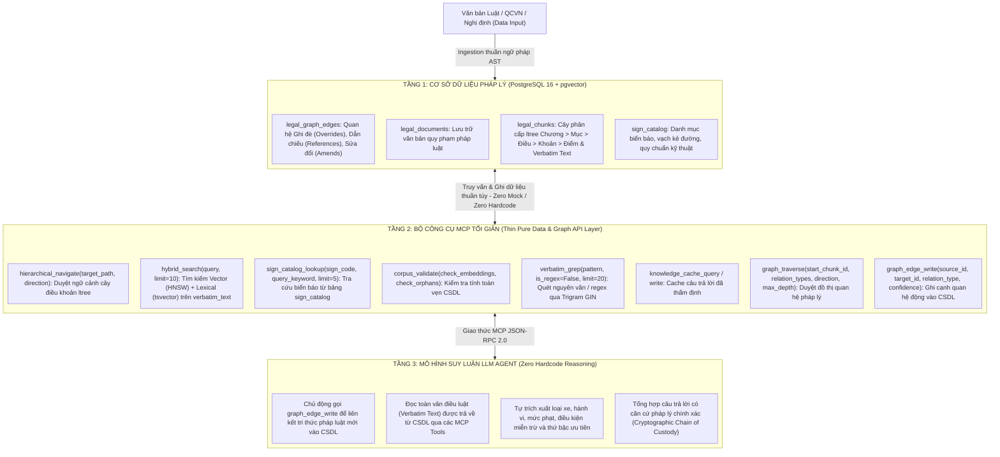

# Original User Request

## 2026-08-31T07:44:28Z

Execute complete architectural purification and restructuring of the Vietnamese Traffic Law Agentic RAG system in `/home/hoang/python/rag` so that the entire codebase operates strictly and purely according to the 3-Tier Zero-Hardcode Minimalist Production Architecture below. Delete all fake simulation code, hardcoded statutory rules, mock branching, over-engineered metadata filters, and brittle tests.

Working directory: /home/hoang/python/rag
Integrity mode: development

---

## 🏛 The Target 3-Tier Minimalist Production Architecture

---

## Requirements

### R1. Triệt tiêu Toàn bộ Bộ lọc Metadata Over-Engineered & Mock Giả lập (`src/rag_eval/legal/`)
- **Tối giản hóa `hybrid_search`**:
  - Xóa bỏ hoàn toàn các tham số bộ lọc metadata dễ gây lỗi và lọc mù: `vehicle_types`, `actor_category`, `norm_roles`, `fine_min_vnd`, `fine_max_vnd`.
  - Signature chuẩn duy nhất: `hybrid_search(query: str, limit: int = 10, document_codes: list[str] | None = None)`.
  - Thực thi thuần túy Dense Vector Search (HNSW) + Lexical Search (tsvector) trên `verbatim_text`, trả về Top-K điều khoản kèm toàn văn để LLM tự đọc và suy luận.
- **Xóa bỏ Phân nhánh Mock Kép**:
  - Xóa bỏ hoàn toàn nhánh `if self._is_mock_pool(pool) or pool is None:` và các tham số kịch bản mẫu (`scenario_type = "POLICE_OVERRIDE_RED_LIGHT"`) trong `src/rag_eval/legal/mcp/tools.py` và `server.py`.
  - Tất cả các tools là Thin API Wrappers giao tiếp trực tiếp với PostgreSQL qua hợp đồng dữ liệu thống nhất.
- **Ingestion & Parser Thuần Ngữ pháp AST**:
  - `parser.py` và `cphc.py` chỉ bóc tách cây văn bản theo đúng cấu trúc ngữ pháp pháp lý (`Chương > Mục > Điều > Khoản > Điểm`) và lưu văn bản nguyên văn `verbatim_text`.
  - Xóa bỏ toàn bộ các hàm regex cố đoán mò loại xe (`_infer_actor`), mức phạt (`_extract_fine_bounds`), hoặc loại vi phạm (`_extract_violations`).
- **Bảo toàn Nền tảng Toán học**: Giữ nguyên Pydantic schemas trong `schemas.py`, Merkle Tree Audit trong `chain_of_custody.py`, và các migration SQL trong `db/sql/`.

### R2. Xóa sạch Test rác & Làm sạch Test Suite (`tests/`)
- Xóa bỏ hoặc viết lại toàn bộ các bài test đang assert vào các tham số lọc cũ (`vehicle_types`, `actor_category`, `fine_min_vnd`), các mock fallback, hoặc kịch bản giả lập.
- Chỉ giữ lại các bài test kiểm chứng:
  1. Hợp đồng API và tính toàn vẹn kiểu dữ liệu (Schema Contract & Type Safety).
  2. Tính toán toán học và Merkle Tree hashing trong Chain of Custody.
  3. Độ chính xác truy vấn và ghi cạnh thực tế trên CSDL PostgreSQL 16.

### R3. Kiểm chuẩn Hệ thống
- Chạy `./scripts/check.sh` (`uv run ruff check --fix && uv run ty check && uv run pytest -v`) đảm bảo 100% test pass, 0 lỗi type, 0 `Any`, 0 lỗi linter.
- Cập nhật lại cây thư mục qua `./scripts/update_dir_tree.sh`.

---

## Acceptance Criteria

### Hệ thống vận hành đúng sơ đồ 3 tầng tối giản
- [ ] `hybrid_search` và toàn bộ MCP Tools không chứa bất kỳ tham số bộ lọc metadata cứng nào (`vehicle_types`, `actor_category`, `fine_min_vnd`...).
- [ ] 0 dòng code Python chứa quy định của luật, thứ tự ưu tiên hoặc kịch bản mẫu giả lập trong `src/rag_eval/legal/`.
- [ ] Ingestion pipeline bóc tách thuần ngữ pháp AST, không đoán mò vi phạm.
- [ ] Đã xóa sạch toàn bộ test rác và test bám vào logic mock/filter cũ trong `tests/`.
- [ ] Toàn bộ test suite và static typecheck (`./scripts/check.sh`) vượt qua sạch sẽ (0 error, 0 `Any`).
