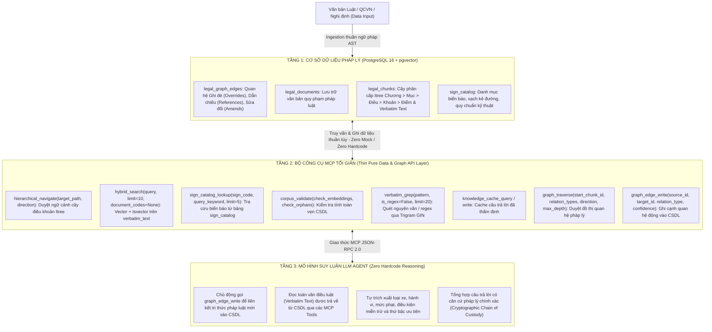

# Project: Vietnamese Traffic Law Agentic RAG Architectural Purification

## Architecture
The system strictly operates under the **3-Tier Zero-Hardcode Minimalist Production Architecture**:

## Feature Inventory
| # | Feature | Description | Milestone | Source |
|---|---------|-------------|-----------|--------|
| 1 | Hybrid Search Simplification | Simplify `hybrid_search` signature to `(query: str, limit: int = 10, document_codes: list[str] | None = None)` removing all metadata filters | M1 | ORIGINAL_REQUEST §R1 |
| 2 | Mock Branching Elimination | Remove `_is_mock_pool`, `scenario_type`, static dictionaries, and fake fallbacks across all MCP tools in `tools.py` and `server.py` | M1 | ORIGINAL_REQUEST §R1 |
| 3 | Pure AST Ingestion & Parser | Eliminate heuristic guessing (`_infer_actor`, `_extract_fine_bounds`, `_extract_violations`) in `cphc.py` and `parser.py`, retaining pure AST parsing (`Chương > Mục > Điều > Khoản > Điểm`) and `verbatim_text` | M1 | ORIGINAL_REQUEST §R1 |
| 4 | Mathematical & Cryptographic Foundations Preservation | Retain Pydantic schemas in `schemas.py`, Merkle Tree Audit in `chain_of_custody.py`, and SQL migrations in `db/sql/` | M1 | ORIGINAL_REQUEST §R1 |
| 5 | Downstream Reasoning Synchronization | Update `pipeline.py`, `traverser.py`, and `planner.py` to interface cleanly with purified MCP tool signatures | M1 | ORIGINAL_REQUEST §R1 |
| 6 | Test Suite Pruning | Delete obsolete mock/fake test files and fixtures (e.g. `tests/test_legal_e2e.py`, `tests/test_legal_tier*.py`, `mock_reasoning.py`, `scenarios_data.py`) | M2 | ORIGINAL_REQUEST §R2 |
| 7 | Test Suite Refinement | Refactor test files asserting on old metadata filters/mocks to validate pure contracts, Merkle math, and PostgreSQL 16 pgvector | M2 | ORIGINAL_REQUEST §R2 |
| 8 | Comprehensive System Verification | Execute `./scripts/check.sh` (`ruff check --fix`, `ty check`, `pytest -v`) ensuring 100% pass, 0 type errors, 0 Any, 0 linter errors, and `./scripts/update_dir_tree.sh` | M3 | ORIGINAL_REQUEST §R3 |

## Milestones
| # | Name | Scope | Dependencies | Status |
|---|------|-------|-------------|--------|
| 1 | M1: Legal Core Purification | Refactor `src/rag_eval/legal/` (tools.py, server.py, parser.py, cphc.py, reasoning/) to zero-mock, zero-hardcode, pure AST | none | DONE |
| 2 | M2: Test Suite Purification | Prune obsolete test files, refactor test callers in `tests/`, retain pure math/Merkle/Postgres tests | M1 | DONE |
| 3 | M3: Comprehensive QA & Verification | Run `scripts/check.sh` (ruff, ty, pytest) and `scripts/update_dir_tree.sh`, achieving 100% clean pass | M1, M2 | DONE |

## Interface Contracts
### MCP Tools ↔ PostgreSQL 16 Stored Procedures

Signatures below are verified against `src/rag_eval/legal/mcp/tools.py`.

- `hybrid_search(query: str, dense_vector: list[float] | None = None, temporal_violation_date: str | None = None, limit: int = 10) -> HybridSearchResult`
- `verbatim_grep(pattern: str, is_regex: bool = False, case_sensitive: bool = False, temporal_violation_date: str | None = None, limit: int = 20) -> VerbatimGrepResult`
- `hierarchical_navigate(path: str | None = None, chunk_id: str | None = None, direction: str = "FULL_ARTICLE") -> HierarchicalNavigateResult`
  - `direction` ∈ `FULL_ARTICLE` | `CHILDREN` | `PARENT_CHAIN` | `SIBLINGS`
- `graph_traverse(start_chunk_id: str, relation_types: list[str] | None = None, direction: str = "OUTGOING", max_depth: int = 2) -> GraphTraverseResult`
- `graph_edge_write(source_id: str, target_id: str, relation_type: str, confidence: float = 1.0) -> GraphEdgeWriteResult`
- `corpus_validate(check_embeddings: bool = True, check_orphans: bool = True) -> CorpusValidateResult`
- Staging lifecycle: `stg_preview`, `stg_patch`, `stg_add_edges`, `stg_commit`

`VerbatimGrepResult` reports `total_matches` (uncapped corpus-wide count via the
`verbatim_grep_count` stored procedure), `returned`, and `truncated`. Reporting
the capped row count would make an agent conclude the corpus contains only
`limit` occurrences of a term — a correctness failure for exhaustive legal
questions.

`hybrid_search` requires a `QueryEmbedder` to be injected for the dense half to
run; `create_mcp_server` and `LegalMCPServer` wire `SentenceTransformerQueryEmbedder`
by default. Without an embedder the tool executes sparse-only and logs a warning.

### Not yet implemented

These appear in the architecture diagram but have no code and no table:

- `sign_catalog_lookup(...)` and the `sign_catalog` table
- `knowledge_cache_query(...)` / `knowledge_cache_write(...)`

### Ingestion invariant

`LegalIngestionPipeline(strict_grounding=True)` runs `enforce_chunk_grounding`
before persistence. Every digit run in a chunk must occur in the cleaned source
document; a violation aborts ingestion. No retrieval metric can detect a chunk
whose fine amount was corrupted during parsing, so ingestion is the only
checkpoint for that failure class.

## Code Layout
- `src/rag_eval/legal/db/`: Database connection pool, migrations, and SQL definitions.
- `src/rag_eval/legal/ingestion/`: Pure AST legal text parsing (`parser.py`, `cphc.py`, `grammar.py`) and graph linking.
- `src/rag_eval/legal/mcp/`: Thin MCP server (`server.py`) and pure data/graph API tools (`tools.py`).
- `src/rag_eval/legal/reasoning/`: Reasoning pipeline (`pipeline.py`, `traverser.py`), Merkle Tree Chain of Custody (`chain_of_custody.py`).
- `src/rag_eval/legal/schemas.py`: Pydantic domain schemas and validation contracts.
- `tests/`: Contract, Merkle Tree hashing, and PostgreSQL integration tests.
