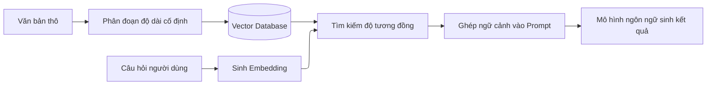
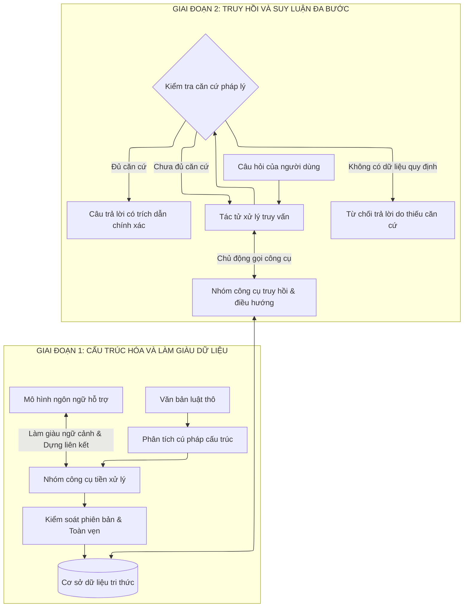

# ĐỀ ÁN NGHIÊN CỨU VÀ PHÁT TRIỂN HỆ THỐNG
# KHUNG TÁC TỬ MCP CHO BÀI TOÁN LÀM GIÀU DỮ LIỆU VÀ SUY LUẬN PHÁP LÝ ĐA BƯỚC

**Lĩnh vực ứng dụng:** Văn bản Quy phạm Pháp luật Giao thông Đường bộ Việt Nam  
**Sinh viên thực hiện:** Lê Bảo Hưng (MSV: 23010090) & Đinh Việt Hoàng (MSV: 32010051)  
**Giảng viên hướng dẫn:** Nguyễn Văn Sơn  

---

## MỤC LỤC TỔNG QUAN

1. [BỐI CẢNH VÀ ĐẶT VẤN ĐỀ](#1-bối-cảnh-và-đặt-vấn-đề)
   * 1.1. Đặc thù cấu trúc của văn bản quy phạm pháp luật Việt Nam
   * 1.2. Hạn chế của mô hình RAG truyền thống
2. [PHƯƠNG PHÁP TIẾP CẬN VÀ NGUYÊN LÝ THIẾT KẾ](#2-phương-pháp-tiếp-cận-và-nguyên-lý-thiết-kế)
   * 2.1. Mở rộng không gian hành động cho mô hình ngôn ngữ lớn qua giao thức MCP
   * 2.2. Khung tác tử hai chiều: Chuẩn bị dữ liệu và Truy hồi đa bước
3. [KIẾN TRÚC TỔNG QUAN VÀ CÁC PHÂN HỆ](#3-kiến-trúc-tổng-quan-và-các-phân-hệ)
   * 3.1. Phân hệ cấu trúc hóa và làm giàu dữ liệu
   * 3.2. Phân hệ kiểm soát toàn vẹn dữ liệu và Giám sát của con người
   * 3.3. Phân hệ truy hồi và suy luận đa bước
4. [CÁC TÌNH HUỐNG ỨNG DỤNG TIÊU BIỂU](#4-các-tình-huống-ứng-dụng-tiêu-biểu)
   * 4.1. Tình huống quy định phân cấp kết hợp
   * 4.2. Tình huống dẫn chiếu liên văn bản
   * 4.3. Tình huống tra cứu bảng biểu kỹ thuật
5. [KẾT QUẢ DỰ KIẾN VÀ ĐÓNG GÓP CỦA ĐỀ TÀI](#5-kết-quả-dự-kiến-và-đóng-góp-của-đề-tài)
6. [KẾT LUẬN](#6-kết-luận)

---

## 1. BỐI CẢNH VÀ ĐẶT VẤN ĐỀ

### 1.1. Đặc thù cấu trúc của văn bản quy phạm pháp luật Việt Nam

Trong đời sống xã hội, các quy định pháp luật về trật tự, an toàn giao thông đường bộ là nhóm thông tin có tần suất tra cứu cao từ phía người dân và doanh nghiệp. Các nội dung tra cứu phổ biến bao gồm mức xử phạt vi phạm hành chính, quy định về nồng độ cồn, tốc độ tối đa, làn đường, biển báo hiệu đường bộ, điều kiện cấp giấy phép lái xe và các trường hợp miễn trừ trách nhiệm.

Tuy nhiên, việc xây dựng hệ thống tự động hóa tra cứu dữ liệu pháp luật Việt Nam gặp một số thách thức đặc thù:

1. **Cấu trúc phân cấp hình thức đa tầng:**  
   Văn bản quy phạm pháp luật (Luật, Nghị định, Thông tư) được tổ chức theo thứ bậc hình thức chặt chẽ: `Văn bản` $\rightarrow$ `Chương` $\rightarrow$ `Mục` $\rightarrow$ `Điều` $\rightarrow$ `Khoản` $\rightarrow$ `Điểm` $\rightarrow$ `Phụ lục`. Một quy định pháp lý hoàn chỉnh thường được cấu thành từ nhiều đơn vị phân cấp khác nhau.
2. **Sự phụ thuộc ngữ nghĩa theo chiều dọc:**  
   Trong các nghị định xử phạt vi phạm hành chính (ví dụ: Nghị định 100/2019/NĐ-CP, Nghị định 123/2021/NĐ-CP), khung tiền phạt và thẩm quyền xử phạt thường được quy định ở phần mở đầu của cấp Khoản, trong khi mô tả chi tiết hành vi vi phạm lại nằm ở các Điểm trực thuộc. Khi tách rời một Điểm con ra khỏi Khoản cha, đoạn văn bản đó sẽ thiếu thông tin về đối tượng áp dụng và chế tài xử phạt.
3. **Mạng lưới dẫn chiếu chéo phức tạp:**  
   Các văn bản pháp luật có mối liên kết hữu cơ thông qua các hình thức dẫn chiếu:
   * **Dẫn chiếu nội bộ:** Liên kết giữa các Điều hoặc giữa các Khoản trong cùng một văn bản.
   * **Dẫn chiếu liên văn bản:** Nghị định dẫn chiếu đến Luật để xác định căn cứ thẩm quyền, hoặc dẫn chiếu đến Quy chuẩn kỹ thuật quốc gia (QCVN) để xác định định nghĩa kỹ thuật của phương tiện, biển báo và vạch kẻ đường.
   * **Văn bản sửa đổi, bổ sung:** Các điều khoản mới được cập nhật, bãi bỏ hoặc thay thế mà không viết lại toàn bộ văn bản gốc.
4. **Sự khác biệt giữa ngôn ngữ tự nhiên và thuật ngữ pháp lý:**  
   Người dùng thường đặt câu hỏi bằng ngôn ngữ thông thường (ví dụ: "vượt đèn đỏ", "đi sai làn"), trong khi văn bản pháp luật sử dụng thuật ngữ chuyên môn chính xác (ví dụ: "không chấp hành hiệu lệnh của đèn tín hiệu giao thông", "đi không đúng làn đường quy định").

---

### 1.2. Hạn chế của mô hình RAG truyền thống

Mô hình Retrieval-Augmented Generation (RAG) truyền thống thường áp dụng một quy trình tuyến tính cố định để xử lý bài toán hỏi đáp trên tài liệu:

Khi áp dụng vào miền dữ liệu văn bản pháp luật, quy trình này tồn tại một số hạn chế kỹ thuật:

* **Mô hình ngôn ngữ hoạt động ở trạng thái thụ động:**  
   Trong RAG truyền thống, mô hình ngôn ngữ lớn (LLM) chỉ đóng vai trò xử lý ngữ cảnh tĩnh được truyền vào từ bước tìm kiếm trước đó. Mô hình không có khả năng chủ động yêu cầu bổ sung thông tin hoặc điều chỉnh chiến lược tìm kiếm khi ngữ cảnh nhận được chưa đầy đủ.
* **Mất ngữ cảnh do chia đoạn cơ học:**  
   Phương pháp phân đoạn văn bản dựa trên độ dài ký tự hoặc ngắt dòng đơn thuần dễ làm đứt gãy mối liên hệ giữa các cấp phân cấp (Chương, Điều, Khoản, Điểm). Điều này khiến các phân đoạn con thiếu thông tin chủ thể và khung chế tài.
* **Hạn chế trong việc giải quyết suy luận đa bước:**  
   Đối với các câu hỏi phức tạp yêu cầu kết hợp thông tin từ nhiều điều khoản hoặc nhiều văn bản khác nhau (ví dụ: xác định hành vi vi phạm ở Nghị định và định nghĩa phương tiện ở Quy chuẩn kỹ thuật), một lượt tìm kiếm vector đơn lẻ khó có thể truy hồi đầy đủ và chính xác tất cả các tài liệu liên quan.
* **Rủi ro sinh thông tin không có căn cứ:**  
   Khi ngữ cảnh được cung cấp không chứa đủ thông tin để trả lời câu hỏi nhưng hệ thống vẫn yêu cầu sinh kết quả, mô hình ngôn ngữ có xu hướng tạo ra thông tin dựa trên xác suất từ ngữ thay vì căn cứ pháp lý xác thực.

---

## 2. PHƯƠNG PHÁP TIẾP CẬN VÀ NGUYÊN LÝ THIẾT KẾ

### 2.1. Mở rộng không gian hành động cho mô hình ngôn ngữ lớn qua giao thức MCP

Để khắc phục các hạn chế nêu trên, đề tài tiếp cận bài toán theo hướng:

> **Chuyển từ cơ chế truyền ngữ cảnh tĩnh sang cơ chế cung cấp không gian công cụ tương tác cho mô hình ngôn ngữ thông qua giao thức chuẩn hóa Model Context Protocol (MCP).**

Giao thức MCP cho phép mô hình ngôn ngữ kết nối trực tiếp với các công cụ nghiệp vụ của máy chủ dữ liệu. Mô hình có thể chủ động gọi công cụ để tra cứu, định vị vị trí phân cấp, duyệt đồ thị dẫn chiếu hoặc kiểm tra lại văn bản nguyên bản trong quá trình xử lý câu hỏi.

---

### 2.2. Khung tác tử hai chiều: Chuẩn bị dữ liệu và Truy hồi đa bước

Hệ thống được thiết kế theo mô hình tác tử tương tác hai chiều, bao quát hai giai đoạn xử lý:

1. **Giai đoạn tiền xử lý và làm giàu dữ liệu:** Mô hình ngôn ngữ tham gia phân tích cấu trúc văn bản, kế thừa ngữ cảnh từ các cấp cha và phát hiện các mối quan hệ dẫn chiếu chéo để hình thành đồ thị liên kết tri thức.
2. **Giai đoạn truy hồi và suy luận:** Tác tử chủ động thực hiện quy trình điều tra nhiều bước, tự do chuyển đổi giữa các công cụ tìm kiếm, điều hướng cây phân cấp và truy vấn đồ thị liên kết cho đến khi thu thập đủ căn cứ pháp lý.

---

## 3. KIẾN TRÚC TỔNG QUAN VÀ CÁC PHÂN HỆ

Hệ thống được tổ chức thành 3 phân hệ chức năng chính:

### 3.1. Phân hệ cấu trúc hóa và làm giàu dữ liệu
* **Bảo toàn ngữ cảnh phân cấp:** Tự động kế thừa tiêu đề Chương, tên Điều và nội dung mở đầu của Khoản cha vào từng Điểm con, giúp mỗi phân đoạn dữ liệu đều mang đầy đủ ý nghĩa độc lập.
* **Xây dựng đồ thị liên kết pháp lý:** Mô hình ngôn ngữ tham gia đọc hiểu và phát hiện các liên kết dẫn chiếu giữa các điều khoản và giữa các văn bản để tạo lập mạng lưới quan hệ.
* **Chuẩn hóa cấu trúc bảng biểu:** Phân tách các phụ lục bảng biểu kỹ thuật phức tạp theo cơ chế bảo toàn tiêu đề cột và hàng trên từng phân đoạn.

### 3.2. Phân hệ kiểm soát toàn vẹn dữ liệu và Giám sát của con người
* **Quản lý phiên bản dạng nhật ký bất biến:** Mọi thao tác chỉnh sửa dữ liệu của mô hình đều được ghi nhận tuần tự, cho phép kiểm tra lịch sử và tái lập trạng thái dữ liệu một cách tất định.
* **Bộ quy tắc tiền kiểm định:** Tự động kiểm tra tính liên tục của cấu trúc phân cấp, tính hợp lệ của đường dẫn và tính đúng đắn của các liên kết đồ thị trước khi lưu vào cơ sở dữ liệu chính thức.
* **Không gian làm việc cho người thẩm định:** Cung cấp giao diện trực quan hỗ trợ chuyên viên đối chiếu văn bản gốc, kiểm tra các đề xuất của mô hình và phê duyệt dữ liệu.

### 3.3. Phân hệ truy hồi và suy luận đa bước
* **Bộ công cụ điều tra đa dạng:** Tác tử được trang bị các công cụ phục vụ tìm kiếm kết hợp (từ khóa và ngữ nghĩa), định vị theo cây phân cấp, lần theo đồ thị dẫn chiếu và so khớp văn bản nguyên bản.
* **Chiến lược suy luận linh hoạt:** Tác tử tự đánh giá mức độ đầy đủ của chứng cứ thu thập được qua từng bước để quyết định tiếp tục tra cứu mở rộng hay tổng hợp câu trả lời.
* **Cơ chế kiểm soát căn cứ:** Tự động kích hoạt thông báo từ chối trả lời khi không có quy định điều chỉnh hoặc thiếu dữ liệu, hạn chế tình trạng suy diễn không có căn cứ.

---

## 4. CÁC TÌNH HUỐNG ỨNG DỤNG TIÊU BIỂU

### 4.1. Tình huống quy định phân cấp kết hợp
* **Nhu cầu:** Tra cứu mức phạt tiền và hình thức tước giấy phép lái xe đối với một hành vi vi phạm cụ thể.
* **Cơ chế xử lý:** Tác tử định vị phân đoạn quy định hành vi vi phạm và mức phạt tiền ở cấp Điểm và Khoản, sau đó chủ động điều hướng lên cấp Điều để truy xuất thêm quy định về hình phạt bổ sung tại Khoản quy định riêng biệt, từ đó tổng hợp câu trả lời đầy đủ.

### 4.2. Tình huống dẫn chiếu liên văn bản
* **Nhu cầu:** Xác định lỗi vi phạm khi quy định xử phạt nằm ở Nghị định nhưng định nghĩa kỹ thuật của phương tiện hoặc biển báo lại nằm ở Quy chuẩn kỹ thuật.
* **Cơ chế xử lý:** Tác tử tra cứu văn bản xử phạt, nhận diện nhu cầu xác minh định nghĩa kỹ thuật, sử dụng công cụ duyệt đồ thị để chuyển tiếp sang Quy chuẩn liên quan nhằm lấy căn cứ đối chiếu trước khi đưa ra kết luận.

### 4.3. Tình huống tra cứu bảng biểu kỹ thuật
* **Nhu cầu:** Tra cứu giới hạn tốc độ tối đa cho phép theo từng loại phương tiện và loại đường.
* **Cơ chế xử lý:** Nhờ dữ liệu bảng biểu đã được chuẩn hóa kèm đầy đủ tiêu đề hàng và cột, tác tử truy xuất chính xác thông số kỹ thuật tương ứng mà không bị nhầm lẫn giữa các cấu hình đường khác nhau.

---

## 5. KẾT QUẢ DỰ KIẾN VÀ ĐÓNG GÓP CỦA ĐỀ TÀI

### 5.1. Đóng góp về mặt phương pháp luận và kỹ thuật
* Đánh giá hiệu quả thực nghiệm của việc áp dụng khung tác tử MCP tương tác hai chiều thay cho mô hình RAG tuyến tính trong miền dữ liệu văn bản pháp luật có cấu trúc phân cấp.
* Đề xuất quy trình quản lý và kiểm soát toàn vẹn dữ liệu có sự kết hợp giữa mô hình ngôn ngữ và sự giám sát của con người.

### 5.2. Đóng góp về mặt thực tiễn
* Cung cấp công cụ hỗ trợ tra cứu các quy định pháp luật giao thông đường bộ với độ chính xác cao, trích dẫn minh bạch và có khả năng giải thích chuỗi lập luận.
* Hỗ trợ quá trình phân tách cấu trúc và liên kết dữ liệu pháp luật một cách có hệ thống.

### 5.3. Sản phẩm dự kiến
1. Máy chủ công cụ theo giao thức MCP phục vụ cả hai nhiệm vụ: làm giàu dữ liệu và truy hồi suy luận.
2. Giao diện làm việc trực quan hỗ trợ rà soát cấu trúc phân cấp, đồ thị liên kết và kiểm duyệt dữ liệu.
3. Cơ sở dữ liệu văn bản pháp luật giao thông đường bộ mẫu đã được chuẩn hóa cấu trúc và thiết lập liên kết dẫn chiếu.
4. Báo cáo đánh giá thực nghiệm trên các bộ câu hỏi kiểm thử thực tế.

### 5.4. Giới hạn phạm vi và Tuyên bố miễn trừ trách nhiệm
Hệ thống đóng vai trò là công cụ hỗ trợ tra cứu thông tin, định vị điều khoản và phân tích cấu trúc quy định pháp luật dựa trên các nguồn văn bản chính thống được nạp vào cơ sở dữ liệu. Kết quả do hệ thống cung cấp chỉ mang tính chất tham khảo khoa học và kỹ thuật, không có giá trị pháp lý thay thế cho văn bản chính thức được ban hành hoặc ý kiến tư vấn chuyên môn của luật sư, cơ quan nhà nước có thẩm quyền.

---

## 6. KẾT LUẬN

Đề tài **"Xây dựng khung tác tử MCP cho bài toán làm giàu dữ liệu và suy luận pháp lý đa bước"** giải quyết bài toán tra cứu văn bản quy phạm pháp luật bằng việc kết hợp năng lực hiểu ngôn ngữ của mô hình ngôn ngữ lớn với giao thức tương tác công cụ chuẩn hóa. 

Bằng cách xây dựng hệ thống theo hướng tác tử chủ động — vừa tham gia làm giàu cấu trúc dữ liệu dưới sự giám sát của con người, vừa tự hành điều tra suy luận đa bước khi tra cứu — đề tài hướng tới việc nâng cao độ chính xác, tính nhất quán và khả năng kiểm chứng trong các ứng dụng tra cứu pháp luật tự động.
