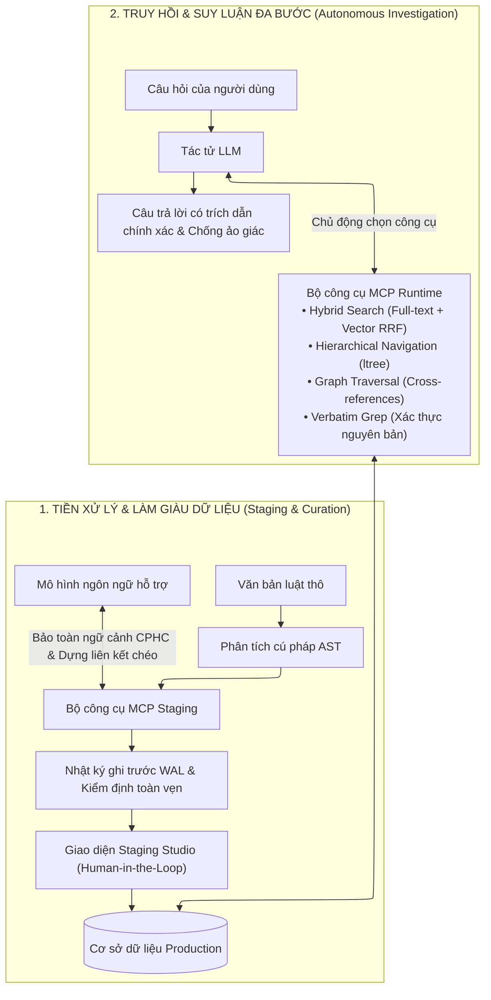

# Vietnamese Traffic Law Agentic RAG Platform & Reviewer Studio

📌 **Task Tracking Board (Notion):** [Theo dõi tiến độ công việc tại đây](https://app.notion.com/p/3dda6736665180e0a325d5ad6290fba5?v=3dda6736665180c39bfd000c1bd53cb0)

---

## Giới thiệu tổng quan

Hệ thống **Vietnamese Traffic Law Agentic RAG Platform** là nền tảng nghiên cứu và thực nghiệm mô hình tác tử tương tác hai chiều dựa trên giao thức **Model Context Protocol (MCP)** trong lĩnh vực Văn bản Quy phạm Pháp luật Giao thông Đường bộ Việt Nam.

Khác với các mô hình RAG truyền thống vốn chỉ truyền ngữ cảnh tĩnh cho mô hình ngôn ngữ sinh câu trả lời, hệ thống mở rộng không gian công cụ (Action Space) cho mô hình ngôn ngữ lớn (LLM) để tự hành tham gia vào toàn bộ vòng đời của tri thức: từ giai đoạn tiền xử lý, cấu trúc hóa dữ liệu có sự giám sát của con người đến giai đoạn truy hồi và suy luận pháp lý đa bước.

---

## Kiến trúc hai chiều của hệ thống

---

## Các thành phần cốt lõi

1. **Khung công cụ chuẩn hóa Model Context Protocol (MCP):**
   * **Nhóm công cụ tiền xử lý (Staging Tools):** Hỗ trợ LLM bóc tách cây phân cấp (`ltree`), bảo toàn ngữ cảnh phân cấp cha-con (CPHC) và thiết lập các cạnh liên kết dẫn chiếu chéo để hình thành Đồ thị tri thức (Knowledge Graph).
   * **Nhóm công cụ truy hồi (Runtime Sensors):** Cung cấp các giác quan cho tác tử tự hành tìm kiếm kết hợp (Hybrid Search), điều hướng dọc theo cây cấu trúc Chương/Điều/Khoản/Điểm, lần theo đồ thị quan hệ và so khớp văn bản nguyên bản.

2. **Cơ chế quản lý dữ liệu bất biến và Giám sát của con người (Human-in-the-Loop):**
   * **Động cơ Write-Ahead Log (WAL):** Lưu trữ toàn bộ lịch sử biến đổi dữ liệu dưới dạng nhật ký tuần tự (append-only), đảm bảo tính toàn vẹn và khả năng tái lập tất định (Deterministic Replay).
   * **Cổng tiền kiểm định (Pre-Flight Validation):** Tự động kiểm tra tính hợp lệ của cây cấu trúc, ngày hiệu lực và các liên kết đồ thị trước khi chuyển vào cơ sở dữ liệu chính thức.
   * **Staging Studio (Web Application):** Không gian làm việc trực quan giúp chuyên viên pháp lý đối chiếu, kiểm duyệt các đề xuất của AI và thực hiện phê chuẩn dữ liệu.

3. **Cơ chế suy luận có căn cứ và Kiểm soát tính chính xác (Zero-Hallucination):**
   * Tác tử tự đánh giá mức độ đầy đủ của bằng chứng thu thập được qua từng bước điều tra.
   * Tự động kích hoạt cơ chế từ chối trả lời khi không có quy định điều chỉnh hoặc thiếu dữ liệu, đảm bảo mọi thông tin đưa ra đều có trích dẫn điều khoản minh bạch và kiểm chứng được.

---

Chi tiết về đề cương nghiên cứu, phương pháp luận và các tình huống ứng dụng thực tế được trình bày đầy đủ tại [PROPOSAL.md](PROPOSAL.md).
