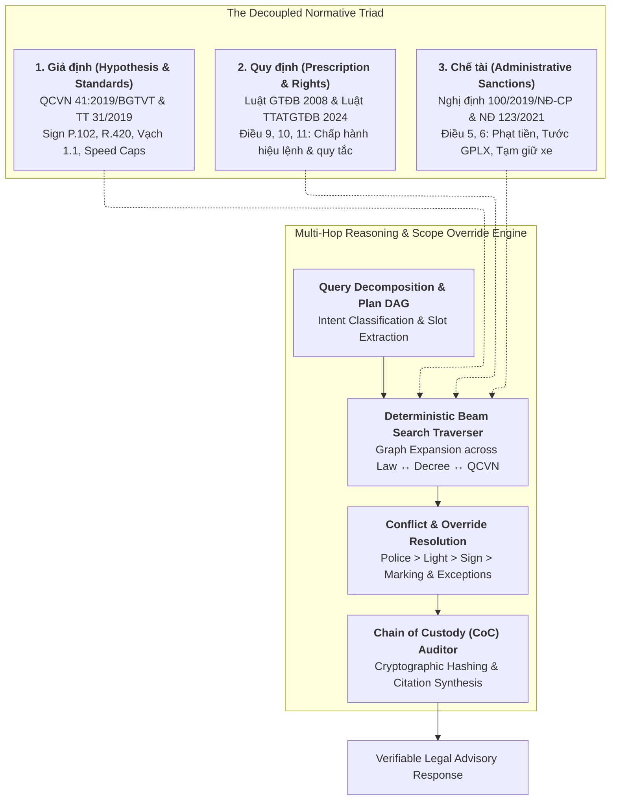
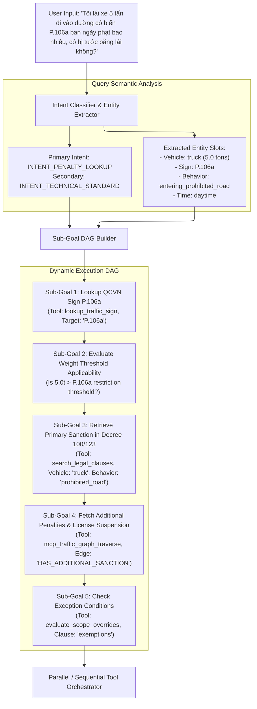
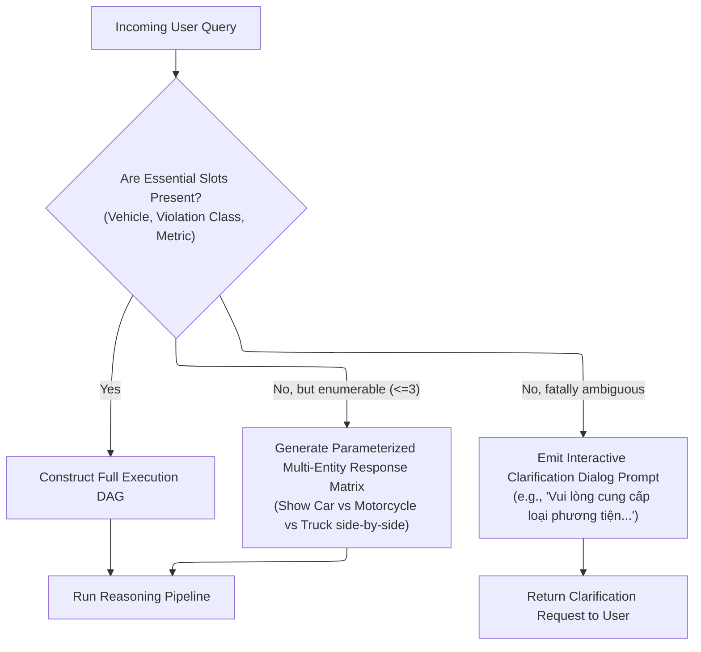
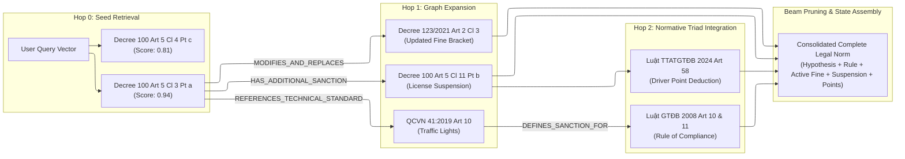
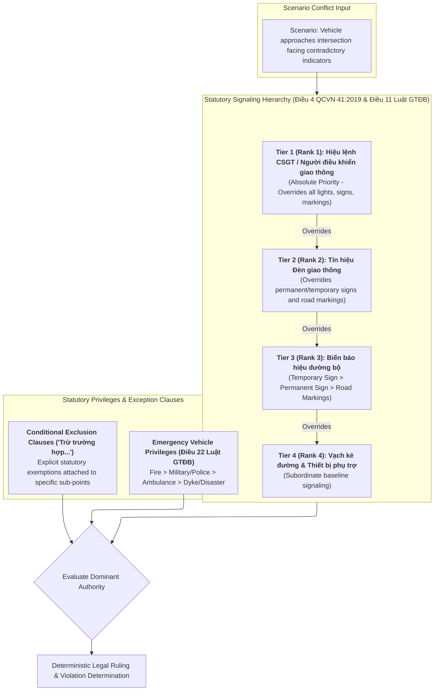
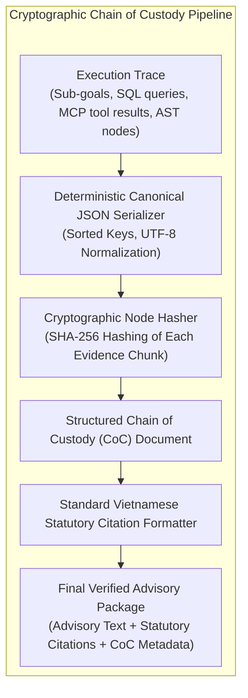
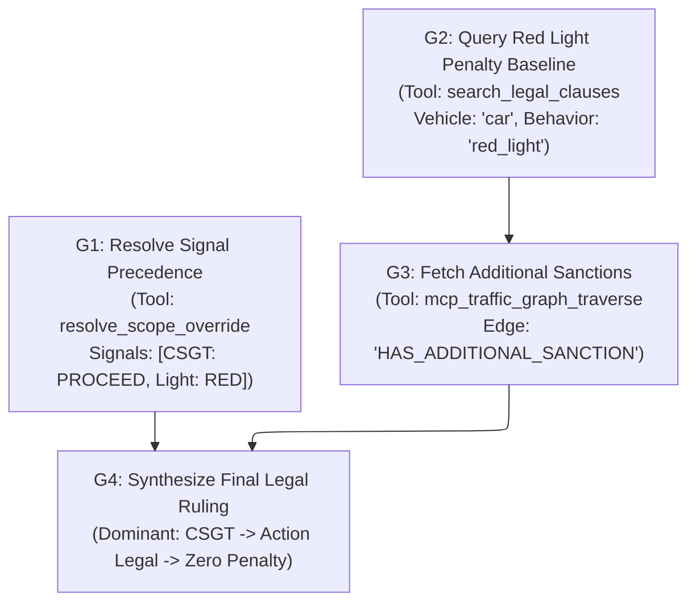
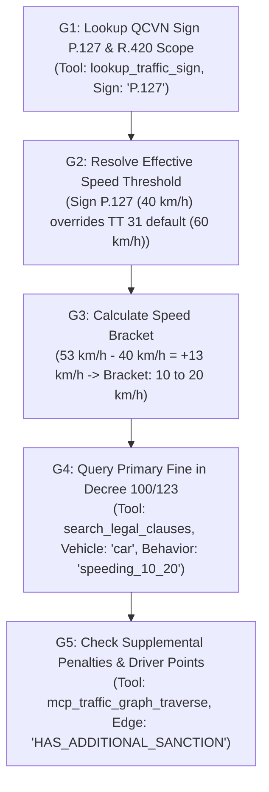
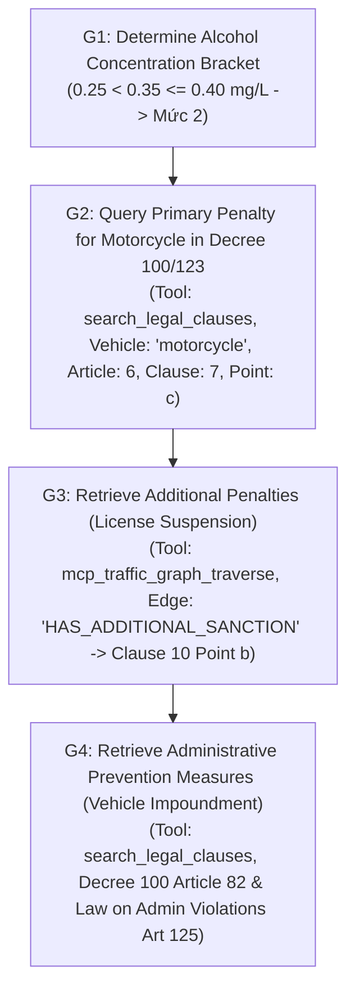
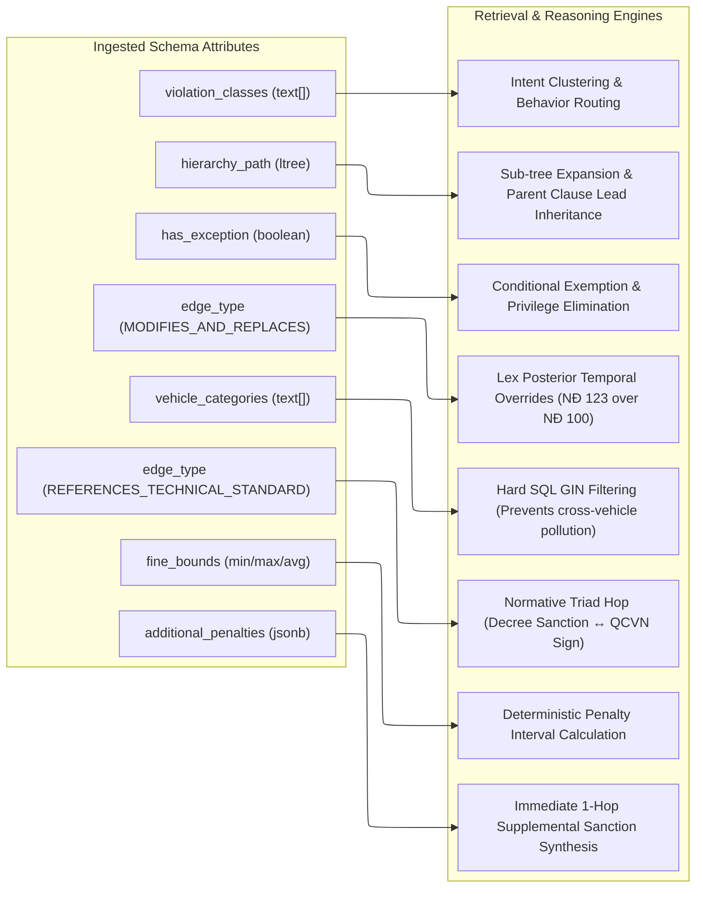

# Architecture Specification: Multi-Hop Reasoning & Scope Override Retrieval Engine for Vietnamese Traffic Legislation

## 1. Executive Summary & Design Principles

Navigating Vietnamese traffic legislation presents unique epistemological and computational challenges for standard Retrieval-Augmented Generation (RAG) systems. The legal framework does not store complete normative rules within single articles; rather, it distributes legal logic across a **Physically Decoupled Normative Triad**:

$$\text{Legal Norm} = \langle \text{Giả định (Hypothesis)}, \text{Quy định (Prescription)}, \text{Chế tài (Sanction)} \rangle$$

1. **Giả định (Hypothesis & Technical Standards)**: Codified primarily in National Technical Regulations (e.g., *QCVN 41:2019/BGTVT* for signs, road markings, traffic light states; *Thông tư 31/2019/TT-BGTVT* for speed thresholds by roadway classification).
2. **Quy định (Prescription & Behavioral Obligations)**: Codified in Primary Statutes (e.g., *Luật Giao thông đường bộ 2008*, *Luật Trật tự, an toàn giao thông đường bộ 2024* - defining foundational traffic rules, right-of-way, and operational duties).
3. **Chế tài (Administrative Sanctions & Penalties)**: Codified in Government Decrees (e.g., *Nghị định 100/2019/NĐ-CP*, amended by *Nghị định 123/2021/NĐ-CP* and supplemented by *Nghị định 168/2024/NĐ-CP* - defining exact monetary fine brackets, driving license suspension durations, point deductions, and vehicle impoundment measures).



### 1.1 Core Engineering Principles

1. **Symmetrical Ingestion-Retrieval Duality**: The retrieval engine directly leverages the rich metadata, `ltree` hierarchical paths, vector embeddings of Canonical Fully Qualified Chunks (CFQC), and relational graph edges constructed during ingestion.
2. **Deterministic Multi-Hop Navigation**: Instead of stochastic, unconstrained LLM agent loops, retrieval across the normative triad follows a deterministic beam-search graph traversal over verified relational edges (`DEFINES_SANCTION_FOR`, `HAS_ADDITIONAL_SANCTION`, `REFERENCES_TECHNICAL_STANDARD`, `MODIFIES_AND_REPLACES`, `OVERRIDES_PRIORITY`, `EXEMPTS_CONDITION`).
3. **Statutory Precedence & Conflict Invariance**: In any traffic conflict scenario (e.g., contradictory signals or emergency vehicle operations), statutory precedence laws (*Điều 4 QCVN 41:2019/BGTVT*, *Điều 11 & Điều 22 Luật GTĐB 2008*) are evaluated as formal algebraic inequality constraints rather than soft probabilistic generation.
4. **Verifiable Chain of Custody (CoC) & Zero Hallucination**: Every output assertion must be bound to a cryptographically validated, machine-auditable provenance trail that traces each retrieved legal node back to its immutable database identifier, SHA-256 chunk hash, and exact statutory citation.
5. **Adaptive Budgeting & Multi-Tier Execution**: Fast-path queries (single-hop factual lookups) bypass multi-hop graph expansion, maintaining sub-250ms p95 latencies, while complex compound dilemmas invoke full DAG execution within strict token budgets.

---

## 2. Query Decomposition, Intent Classification & Planning Engine

Complex user queries in the legal domain are frequently compound, colloquial, ambiguous, or underspecified. The Query Decomposition & Planning Engine translates raw natural language into a structured Directed Acyclic Graph (DAG) of discrete retrieval sub-goals.



### 2.1 Intent Classification Taxonomy

The system defines 6 primary legal intent classes:

| Intent Class | Semantic Objective | Primary Target Instrument | Target MCP Tool Pipeline |
|---|---|---|---|
| `INTENT_PENALTY_LOOKUP` | Retrieve fine amounts, license suspensions, impoundment | Decree 100/2019, 123/2021, 168/2024 | `search_legal_clauses` $\rightarrow$ `mcp_traffic_graph_traverse` |
| `INTENT_BEHAVIOR_VALIDATION` | Check legality of an action or maneuver | Luật GTĐB 2008 / Luật TTATGTĐB 2024 | `search_legal_clauses` $\rightarrow$ `get_hierarchical_context` |
| `INTENT_TECHNICAL_STANDARD` | Query meaning, dimension, or validity of sign/marking | QCVN 41:2019/BGTVT, TT 31/2019 | `lookup_traffic_sign` $\rightarrow$ `lookup_road_marking` |
| `INTENT_PRIORITY_CONFLICT` | Resolve contradictory signals or emergency rights | QCVN 41 (Art 4), Luật GTĐB (Art 11, 22) | `resolve_scope_override` $\rightarrow$ `mcp_traffic_graph_traverse` |
| `INTENT_PROCEDURAL_TIMELINE` | Inquire about payment deadlines, points, appeals | Law on Handling Administrative Violations | `search_legal_clauses` |
| `INTENT_COMPARATIVE_SYNTHESIS`| Compare penalties across vehicle classes or speeds | Decree 100/2019, 123/2021 | `search_legal_clauses` (multi-entity batch) |

### 2.2 Slot-Filling Ontology & Pydantic Data Structures

```python
"""
Core Pydantic schemas for Query Decomposition, Intent Classification, and DAG Planning.
"""
from enum import Enum
from typing import Any, Literal
from pydantic import BaseModel, Field


class LegalIntent(str, Enum):
    INTENT_PENALTY_LOOKUP = "INTENT_PENALTY_LOOKUP"
    INTENT_BEHAVIOR_VALIDATION = "INTENT_BEHAVIOR_VALIDATION"
    INTENT_TECHNICAL_STANDARD = "INTENT_TECHNICAL_STANDARD"
    INTENT_PRIORITY_CONFLICT = "INTENT_PRIORITY_CONFLICT"
    INTENT_PROCEDURAL_TIMELINE = "INTENT_PROCEDURAL_TIMELINE"
    INTENT_COMPARATIVE_SYNTHESIS = "INTENT_COMPARATIVE_SYNTHESIS"


class VehicleCategory(str, Enum):
    CAR_PASSENGER = "CAR_PASSENGER"         # Ô tô con (<= 9 chỗ, pickup < 950kg)
    CAR_TRUCK = "CAR_TRUCK"                 # Ô tô tải (>= 950kg)
    CAR_BUS = "CAR_BUS"                     # Ô tô khách (> 9 chỗ)
    CAR_TRACTOR = "CAR_TRACTOR"             # Ô tô đầu kéo, sơ mi rơ moóc
    MOTORCYCLE = "MOTORCYCLE"               # Xe mô tô (dung tích >= 50cc hoặc điện > 4kW)
    MOPED = "MOPED"                         # Xe gắn máy (< 50cc, vận tốc <= 50km/h)
    E_MOPED = "E_MOPED"                     # Xe máy điện (<= 4kW, <= 50km/h)
    E_BICYCLE = "E_BICYCLE"                 # Xe đạp điện (<= 250W, có bàn đạp)
    BICYCLE_PRIMITIVE = "BICYCLE_PRIMITIVE" # Xe đạp, xe thô sơ, xích lô, xe súc vật kéo
    SPECIALIZED_MACHINE = "SPECIALIZED_MACHINE" # Xe máy chuyên dùng (thi công, nông nghiệp)
    PRIORITY_VEHICLE = "PRIORITY_VEHICLE"   # Xe ưu tiên (Cứu thương, Chữa cháy, Công an, Quân sự)


class ExtractedEntities(BaseModel):
    vehicle_category: VehicleCategory | None = Field(
        default=None, description="Primary vehicle type identified in query"
    )
    vehicle_weight_tons: float | None = Field(
        default=None, description="Gross vehicle weight or payload in metric tons"
    )
    recorded_speed_kmh: float | None = Field(
        default=None, description="Actual driving speed recorded"
    )
    speed_limit_kmh: float | None = Field(
        default=None, description="Applicable speed limit on roadway"
    )
    alcohol_breath_mg_l: float | None = Field(
        default=None, description="Breath alcohol concentration in mg/1L air"
    )
    alcohol_blood_mg_100ml: float | None = Field(
        default=None, description="Blood alcohol concentration in mg/100mL blood"
    )
    traffic_sign_codes: list[str] = Field(
        default_factory=list, description="Referenced sign codes (e.g. ['P.102', 'P.106a'])"
    )
    road_marking_codes: list[str] = Field(
        default_factory=list, description="Referenced marking codes (e.g. ['1.1', '2.2'])"
    )
    location_context: Literal["urban_residential", "rural_non_residential", "expressway", "unknown"] = Field(
        default="unknown", description="Roadway classification and environment"
    )
    is_emergency_mission: bool = Field(
        default=False, description="Whether vehicle was operating under emergency duty"
    )
    has_conflicting_authority: bool = Field(
        default=False, description="Whether query involves multiple contradictory signals"
    )
    effective_year: int = Field(
        default=2026, description="Statutory temporal horizon for legal validity"
    )


class SubGoalType(str, Enum):
    LOOKUP_TECHNICAL_SPEC = "LOOKUP_TECHNICAL_SPEC"
    SEARCH_PRIMARY_SANCTION = "SEARCH_PRIMARY_SANCTION"
    EXPAND_ADDITIONAL_SANCTION = "EXPAND_ADDITIONAL_SANCTION"
    EVALUATE_PRIORITY_CASCADE = "EVALUATE_PRIORITY_CASCADE"
    CHECK_EXEMPTION_CLAUSES = "CHECK_EXEMPTION_CLAUSES"
    VERIFY_TEMPORAL_AMENDMENT = "VERIFY_TEMPORAL_AMENDMENT"


class SubGoalNode(BaseModel):
    goal_id: str = Field(description="Unique identifier for the sub-goal, e.g. 'G1'")
    goal_type: SubGoalType
    mcp_tool_name: str
    tool_arguments: dict[str, Any]
    dependencies: list[str] = Field(
        default_factory=list, description="List of goal_ids that must complete before this node"
    )
    can_execute_parallel: bool = Field(
        default=False, description="Whether this goal can execute concurrently with siblings"
    )


class ExecutionPlanDAG(BaseModel):
    query_id: str
    original_query: str
    primary_intent: LegalIntent
    extracted_entities: ExtractedEntities
    sub_goals: list[SubGoalNode]
    execution_order: list[list[str]] = Field(
        description="Topologically sorted execution stages: each stage contains goal_ids that run in parallel"
    )
    fallback_clarification_prompt: str | None = Field(
        default=None, description="Interactive dialog prompt if query is fatally underspecified"
    )
```

### 2.3 Ambiguity Resolution & Dialogue Policy

When a user query lacks required variables necessary to uniquely identify a legal sanction (e.g., `"Tôi đi quá tốc độ 15km/h bị phạt bao nhiêu?"` without specifying whether the vehicle is a car, motorcycle, or tractor), the engine uses an **Ambiguity Resolution Dialogue Policy**:



1. **Fatal Ambiguity Threshold**: If the vehicle type is missing and the query specifies an action whose penalty differs fundamentally across all 5 vehicle classes (e.g. general signal disobedience), the engine emits an immediate interactive clarification prompt.
2. **Parameterized Matrix Fallback**: If the query is partially specified (e.g., speeding by 15 km/h in a residential area without vehicle type), the planner constructs a 3-way parallel DAG branching across `CAR`, `MOTORCYCLE`, and `TRUCK`, synthesizing a structured comparative matrix in the final response.

---

## 3. Deterministic Multi-Hop Traversal Algorithms across Normative Triad

Standard graph RAG systems often suffer from exponential branch explosion or stochastic hallucinations when traversing multi-hop relationships. Our engine implements a **Deterministic Beam-Search Triad Traverser** over the PostgreSQL relational edge graph (`legal_graph_edges`).

### 3.1 Mathematical Formulation of Normative Traversal

Let the statutory knowledge graph be represented as a directed attributed multigraph:

$$\mathcal{G} = (\mathcal{V}, \mathcal{E}, \mathcal{T}_v, \mathcal{T}_e)$$

Where:
- $\mathcal{V}$ is the set of legal nodes (Documents, Articles, Clauses, Sub-points, Technical Signs, Road Markings).
- $\mathcal{E} \subseteq \mathcal{V} \times \mathcal{V} \times \mathcal{T}_e$ is the set of directed typed edges.
- $\mathcal{T}_e \in \{\text{DEFINES\_SANCTION\_FOR}, \text{HAS\_ADDITIONAL\_SANCTION}, \text{REFERENCES\_TECHNICAL\_STANDARD}, \text{MODIFIES\_AND\_REPLACES}, \text{OVERRIDES\_PRIORITY}, \text{EXEMPTS\_CONDITION}\}$.

For a query $q$ and start node $v_0$, the beam search algorithm maintains a beam of active paths $\mathcal{B}_t = \{P_1, P_2, \dots, P_k\}$ at hop step $t$. Each path $P = (v_0, e_1, v_1, \dots, e_t, v_t)$ is evaluated via a composite scoring function:

$$\mathcal{S}(P, q) = \lambda_1 \cdot \text{Sim}_{\text{dense}}(q, v_t) + \lambda_2 \cdot \text{BM25}(q, v_t) + \lambda_3 \cdot \text{EdgePriority}(e_t) + \lambda_4 \cdot \text{HierarchyDepth}(v_t)$$

Where:
- $\text{Sim}_{\text{dense}}(q, v_t) = \frac{\mathbf{E}(q) \cdot \mathbf{E}(v_t)}{\|\mathbf{E}(q)\| \|\mathbf{E}(v_t)\|}$ (Cosine similarity of dense embeddings).
- $\text{EdgePriority}(e)$ assigns higher structural weights to mandatory legal links:
  $$\text{Weight}(\text{MODIFIES\_AND\_REPLACES}) = 1.0, \quad \text{Weight}(\text{HAS\_ADDITIONAL\_SANCTION}) = 0.95, \quad \text{Weight}(\text{REFERENCES\_TECHNICAL\_STANDARD}) = 0.90$$
- $\text{HierarchyDepth}(v)$ rewards atomic sub-points (`Điểm` level) over broad generic chapter overviews.



### 3.2 Beam Search Traversal Algorithm Implementation

```python
"""
Deterministic Multi-Hop Beam Search Graph Traverser over PostgreSQL + pgvector.
"""
from dataclasses import dataclass, field
from typing import Any


@dataclass
class TraversalNode:
    node_id: str
    hierarchy_path: str
    document_code: str
    normative_role: str
    content_text: str
    metadata: dict[str, Any]
    score: float


@dataclass
class TraversalPath:
    nodes: list[TraversalNode] = field(default_factory=list)
    edge_types: list[str] = field(default_factory=list)
    cumulative_score: float = 0.0

    @property
    def current_node(self) -> TraversalNode:
        return self.nodes[-1]


class DeterministicTriadTraverser:
    def __init__(self, mcp_client, beam_width: int = 3, max_depth: int = 4):
        self.mcp = mcp_client
        self.beam_width = beam_width
        self.max_depth = max_depth

    async def traverse(
        self,
        query: str,
        vehicle_category: str,
        violation_class: str,
        seed_chunk_ids: list[str] | None = None
    ) -> list[TraversalPath]:
        """
        Executes bounded deterministic beam search across Law, Decree, and QCVN.
        """
        # Step 1: Initialize Seed Nodes if not explicitly provided
        if not seed_chunk_ids:
            seed_results = await self.mcp.call_tool("hybrid_legal_search", {
                "query": query,
                "vehicle_category": vehicle_category,
                "violation_class": violation_class,
                "limit": self.beam_width
            })
            active_beam: list[TraversalPath] = [
                TraversalPath(
                    nodes=[TraversalNode(
                        node_id=res["chunk_id"],
                        hierarchy_path=res["hierarchy_path"],
                        document_code=res["document_code"],
                        normative_role=res["normative_role"],
                        content_text=res["content_text"],
                        metadata=res["metadata"],
                        score=res["score"]
                    )],
                    cumulative_score=res["score"]
                )
                for res in seed_results["matches"]
            ]
        else:
            # Seed from specific chunk IDs
            active_beam = []
            for cid in seed_chunk_ids:
                node_data = await self.mcp.call_tool("get_hierarchical_context", {"chunk_id": cid})
                active_beam.append(
                    TraversalPath(
                        nodes=[TraversalNode(
                            node_id=cid,
                            hierarchy_path=node_data["hierarchy_path"],
                            document_code=node_data["document_code"],
                            normative_role=node_data["normative_role"],
                            content_text=node_data["lead_text"] + "\n" + node_data["body_text"],
                            metadata=node_data["metadata"],
                            score=1.0
                        )],
                        cumulative_score=1.0
                    )
                )

        completed_paths: list[TraversalPath] = []

        # Step 2: Iterative Graph Expansion
        for depth in range(self.max_depth):
            candidate_paths: list[TraversalPath] = []

            for path in active_beam:
                curr = path.current_node
                
                # Fetch outgoing and incoming edges
                edges = await self.mcp.call_tool("traverse_normative_graph", {
                    "source_node_id": curr.node_id,
                    "direction": "BOTH",
                    "allowed_edge_types": [
                        "DEFINES_SANCTION_FOR",
                        "HAS_ADDITIONAL_SANCTION",
                        "REFERENCES_TECHNICAL_STANDARD",
                        "MODIFIES_AND_REPLACES",
                        "REPEALS",
                        "OVERRIDES_PRIORITY",
                        "EXEMPTS_CONDITION",
                        "GUIDES",
                        "DEFINES_TERM"
                    ]
                })

                if not edges["adjacent_edges"]:
                    completed_paths.append(path)
                    continue

                for edge in edges["adjacent_edges"]:
                    target = edge["target_node"]
                    # Loop avoidance
                    if any(n.node_id == target["chunk_id"] for n in path.nodes):
                        continue

                    # Calculate edge weight multiplier
                    edge_weight = self._get_edge_priority(edge["edge_type"])
                    step_score = (target["semantic_similarity"] * 0.6 + edge_weight * 0.4)
                    new_cum_score = path.cumulative_score + step_score

                    new_node = TraversalNode(
                        node_id=target["chunk_id"],
                        hierarchy_path=target["hierarchy_path"],
                        document_code=target["document_code"],
                        normative_role=target["normative_role"],
                        content_text=target["content_text"],
                        metadata=target["metadata"],
                        score=step_score
                    )

                    new_path = TraversalPath(
                        nodes=path.nodes + [new_node],
                        edge_types=path.edge_types + [edge["edge_type"]],
                        cumulative_score=new_cum_score
                    )
                    candidate_paths.append(new_path)

            if not candidate_paths:
                break

            # Sort and prune beam to beam_width
            candidate_paths.sort(key=lambda p: p.cumulative_score, reverse=True)
            active_beam = candidate_paths[:self.beam_width]

        completed_paths.extend(active_beam)
        completed_paths.sort(key=lambda p: p.cumulative_score, reverse=True)
        return completed_paths[:self.beam_width]

    def _get_edge_priority(self, edge_type: str) -> float:
        priorities = {
            "MODIFIES_AND_REPLACES": 1.0,
            "HAS_ADDITIONAL_SANCTION": 0.95,
            "REFERENCES_TECHNICAL_STANDARD": 0.90,
            "OVERRIDES_PRIORITY": 0.85,
            "DEFINES_SANCTION_FOR": 0.80,
            "EXEMPTS_CONDITION": 0.80
        }
        return priorities.get(edge_type, 0.5)
```

### 3.3 Token Budget Management & Context Assembly

To prevent context window saturation while maintaining complete legal evidence trails, the retrieval engine applies a **Hierarchical Deduplication & Lead-Sentence Fusion Algorithm**:

1. **Prefix Pruning**: Sibling sub-points (*Điểm a, Điểm b*) sharing the same Article and Clause lead sentence are fused under a single shared header.
2. **Amendment Resolution**: If an edge `MODIFIES_AND_REPLACES` is resolved, the obsolete text is pruned from the primary LLM context window and placed into the verification audit metadata, preventing the generation model from quoting superseded fine ranges.
3. **Token Allocation Budget**:
   - Total Budget: 4,096 tokens.
   - Core Sanctions & Penalties: 1,600 tokens (40%).
   - Technical Specifications & Sign Definitions: 800 tokens (20%).
   - Priority Rules & Overrides: 600 tokens (15%).
   - Hierarchy Context & Metadata: 400 tokens (10%).
   - Generation & Chain of Custody Headroom: 696 tokens (15%).

---

## 4. Conflict Resolution & Scope Override Engine

Traffic legislation contains inherent hierarchies of authority and conditional exception clauses. The Scope Override Engine deterministically resolves these interactions.



### 4.1 Signaling Precedence Formalization

Let $\mathcal{I} = \{s_1, s_2, \dots, s_m\}$ be the set of active signals or commands in a traffic scenario. Each signal $s_i$ is mapped to a strictly ordered priority tuple:

$$\text{PrecedenceTuple}(s_i) = \langle \text{TierRank}(s_i), \text{Temporality}(s_i), \text{Specialty}(s_i) \rangle$$

Where:
- $\text{TierRank}(s_i) \in \{1, 2, 3, 4\}$:
  * $1$: Traffic Police / Authorized Officer (*Hiệu lệnh của người điều khiển giao thông*).
  * $2$: Traffic Lights (*Tín hiệu đèn giao thông*).
  * $3$: Traffic Signs (*Biển báo hiệu đường bộ*).
  * $4$: Road Markings (*Vạch kẻ đường*).
- $\text{Temporality}(s_i) \in \{1: \text{Temporary / Di động}, 2: \text{Permanent / Cố định}\}$. Temporary signs take precedence over permanent signs per *Khoản 4.3 Điều 4 QCVN 41:2019/BGTVT*.
- $\text{Specialty}(s_i) \in \{1: \text{Specific Restriction}, 2: \text{General Restriction}\}$.

The dominant signal $s^*$ is determined by lexicographical minimization:

$$s^* = \arg\min_{s_i \in \mathcal{I}} \text{PrecedenceTuple}(s_i)$$

Any driver action complying with $s^*$ is **strictly non-violating**, rendering lower-tier conflicting restrictions void.

### 4.2 Emergency Vehicle Privilege Hierarchy (Điều 22 Luật GTĐB 2008 / Điều 27 Luật TTATGTĐB 2024)

When an emergency vehicle operates with statutory signaling (sirens, beacon lights, priority flags), it is exempt from standard speed limits, one-way road restrictions, and red traffic lights.

The statutory privilege lattice:

$$\text{Xe Chữa cháy} \succ \text{Xe Quân sự / Công an khẩn cấp} \succ \text{Xe Cứu thương cấp cứu} \succ \text{Xe Hộ đê / Thiên tai} \succ \text{Đoàn xe tang}$$

```python
"""
Scope Override and Conflict Resolution Engine.
"""
from dataclasses import dataclass
from enum import IntEnum
from typing import Literal


class SignalTier(IntEnum):
    POLICE_OFFICER = 1      # Hiệu lệnh CSGT
    TRAFFIC_LIGHT = 2       # Đèn tín hiệu
    TRAFFIC_SIGN = 3        # Biển báo hiệu
    ROAD_MARKING = 4        # Vạch kẻ đường


class Temporality(IntEnum):
    TEMPORARY = 1           # Biển tạm thời / Công trường
    PERMANENT = 2           # Biển cố định


@dataclass(frozen=True)
class TrafficSignalCommand:
    source_type: SignalTier
    temporality: Temporality
    command_directive: Literal["PROCEED", "STOP", "TURN_LEFT", "TURN_RIGHT", "SPEED_LIMIT"]
    speed_cap_kmh: float | None = None
    legal_citation: str = ""


@dataclass
class ConflictEvaluationResult:
    dominant_signal: TrafficSignalCommand
    suppressed_signals: list[TrafficSignalCommand]
    is_driver_action_legal: bool
    ruling_rationale: str
    legal_basis: list[str]


class ScopeOverrideEngine:
    def resolve_signal_conflict(
        self,
        active_signals: list[TrafficSignalCommand],
        driver_action: Literal["PROCEED", "STOP", "TURN_LEFT", "TURN_RIGHT", "MAINTAIN_SPEED"],
        driver_speed_kmh: float | None = None
    ) -> ConflictEvaluationResult:
        """
        Determines the legally governing signal command and evaluates compliance.
        """
        if not active_signals:
            raise ValueError("Conflict resolution requires at least one active signal command.")

        # Sort signals by (Tier, Temporality) ascending
        sorted_signals = sorted(
            active_signals,
            key=lambda s: (s.source_type.value, s.temporality.value)
        )

        dominant = sorted_signals[0]
        suppressed = sorted_signals[1:]

        # Evaluate compliance
        is_legal = False
        rationale_parts = []

        if dominant.source_type == SignalTier.POLICE_OFFICER:
            rationale_parts.append(
                "Theo Khoản 4.1 Điều 4 QCVN 41:2019/BGTVT và Điều 11 Luật GTĐB 2008, "
                "hiệu lệnh của người điều khiển giao thông có hiệu lực cao nhất, "
                "người tham gia giao thông phải chấp hành hiệu lệnh của CSGT ngay cả khi "
                "hiệu lệnh trái với tín hiệu đèn, biển báo hoặc vạch kẻ đường."
            )
            is_legal = (driver_action == dominant.command_directive)

        elif dominant.source_type == SignalTier.TRAFFIC_LIGHT:
            rationale_parts.append(
                "Theo Khoản 4.2 Điều 4 QCVN 41:2019/BGTVT, tín hiệu đèn giao thông "
                "ghi đè và có hiệu lực cao hơn biển báo hiệu đường bộ và vạch kẻ đường."
            )
            is_legal = (driver_action == dominant.command_directive)

        elif dominant.source_type == SignalTier.TRAFFIC_SIGN:
            if dominant.temporality == Temporality.TEMPORARY:
                rationale_parts.append(
                    "Theo Khoản 4.3 Điều 4 QCVN 41:2019/BGTVT, biển báo tạm thời có hiệu lực "
                    "cao hơn biển báo cố định và vạch kẻ đường."
                )
            else:
                rationale_parts.append(
                    "Theo Khoản 4.4 Điều 4 QCVN 41:2019/BGTVT, biển báo hiệu cố định có hiệu lực "
                    "cao hơn vạch kẻ đường."
                )
            
            if dominant.command_directive == "SPEED_LIMIT" and driver_speed_kmh is not None and dominant.speed_cap_kmh is not None:
                is_legal = (driver_speed_kmh <= dominant.speed_cap_kmh)
            else:
                is_legal = (driver_action == dominant.command_directive)

        else:  # ROAD_MARKING
            is_legal = (driver_action == dominant.command_directive)

        legal_basis = [dominant.legal_citation] + [s.legal_citation for s in suppressed]
        legal_basis.append("QCVN 41:2019/BGTVT Điều 4")
        legal_basis.append("Luật Giao thông đường bộ 2008 Điều 11")

        return ConflictEvaluationResult(
            dominant_signal=dominant,
            suppressed_signals=suppressed,
            is_driver_action_legal=is_legal,
            ruling_rationale=" ".join(rationale_parts),
            legal_basis=list(dict.fromkeys(legal_basis))
        )

    def evaluate_emergency_privilege(
        self,
        vehicle_type: str,
        is_emergency_mission: bool,
        has_active_signals: bool,
        behavior_type: str
    ) -> tuple[bool, str]:
        """
        Evaluates statutory emergency exemptions under Art 22 Law 2008 / Art 27 Law 2024.
        """
        privileged_classes = [
            "fire_truck", "military_emergency", "police_emergency",
            "ambulance_emergency", "dyke_rescue", "natural_disaster_relief"
        ]

        if vehicle_type in privileged_classes and is_emergency_mission and has_active_signals:
            return (
                True,
                f"Phương tiện '{vehicle_type}' đang thực hiện nhiệm vụ khẩn cấp có phát tín hiệu "
                "ưu tiên (còi, đèn, cờ) theo quy định tại Điều 22 Luật GTĐB 2008 / Điều 27 Luật TTATGTĐB 2024, "
                f"được quyền ưu tiên đi trước và được miễn trừ xử phạt đối với hành vi '{behavior_type}'."
            )
        return (False, "Phương tiện không đáp ứng đầy đủ điều kiện xe ưu tiên đang làm nhiệm vụ.")
```

### 4.3 Conditional Exception Matching Engine ("Trừ trường hợp...")

Vietnamese legal provisions frequently embed exclusionary clauses directly in sub-point texts (e.g., *"Đi vào đường có biển báo hiệu có nội dung cấm... trừ các xe ưu tiên đang đi làm nhiệm vụ..."* or *"Không chấp hành hiệu lệnh... trừ trường hợp có tín hiệu cho phép rẽ phải"*).

During retrieval:
1. Ingestion metadata field `has_exception` is queried via `evaluate_scope_overrides`.
2. The user's situational parameters are matched against `exception_clause_text` predicates.
3. If an exemption predicate evaluates to `TRUE`, the violation penalty is automatically zeroed out, and the specific exempting statutory clause is bound to the output proof.

---

## 5. Verifiable Legal Citation Generation & Audit Trails

To guarantee complete judicial traceability, prevent hallucinations, and provide cryptographic proof of reasoning integrity, every response emitted by the pipeline contains a structured **Chain of Custody (CoC)**.



### 5.1 Standard Vietnamese Statutory Citation Protocol

All generated legal explanations must conform to the authoritative statutory citation structure:

$$\text{Căn cứ} = \text{[Điểm]} \rightarrow \text{[Khoản]} \rightarrow \text{[Điều]} \rightarrow \text{[Văn bản pháp luật gốc]} + \text{[Văn bản sửa đổi, bổ sung (nếu có)]}$$

#### Mandatory Output Format Rubric:
1. **Hành vi vi phạm**: Tên định danh hành vi chính xác theo văn bản quy phạm pháp luật.
2. **Căn cứ pháp lý xử phạt chính**: Điểm... Khoản... Điều... Nghị định... (sửa đổi, bổ sung bởi Nghị định...).
3. **Mức phạt tiền**: Khoảng tiền phạt từ [Min] đến [Max] VNĐ (mức trung bình [Avg] VNĐ theo Khoản 4 Điều 23 Luật Xử lý vi phạm hành chính).
4. **Hình thức phạt bổ sung**: Tước quyền sử dụng Giấy phép lái xe từ [Min] đến [Max] tháng (Điểm... Khoản... Điều...).
5. **Biện pháp khắc phục hậu quả & Tạm giữ phương tiện**: Tạm giữ phương tiện đến [N] ngày / Buộc khôi phục tình trạng ban đầu (nếu có).
6. **Quy chuẩn kỹ thuật / Quy tắc ứng xử liên quan**: Tên quy chuẩn kỹ thuật (QCVN 41:2019/BGTVT, Thông tư 31/2019/TT-BGTVT) hoặc Điều luật tương ứng trong Luật GTĐB 2008 / Luật TTATGTĐB 2024.

### 5.2 Structured Chain of Custody (CoC) JSON Specification

```json
{
  "$schema": "http://json-schema.org/draft-07/schema#",
  "title": "VerifiableLegalChainOfCustody",
  "type": "object",
  "properties": {
    "trace_id": { "type": "string", "example": "coc-20260829-traff-9081" },
    "session_id": { "type": "string" },
    "query_fingerprint_sha256": { "type": "string", "example": "e3b0c44298fc1c149afbf4c8996fb92427ae41e4649b934ca495991b7852b855" },
    "execution_timestamp": { "type": "string", "format": "date-time" },
    "plan_summary": {
      "type": "object",
      "properties": {
        "primary_intent": { "type": "string" },
        "total_subgoals": { "type": "integer" },
        "execution_path": { "type": "array", "items": { "type": "string" } }
      }
    },
    "retrieval_steps": {
      "type": "array",
      "items": {
        "type": "object",
        "properties": {
          "step_index": { "type": "integer" },
          "action": { "type": "string" },
          "tool_invoked": { "type": "string" },
          "target_node_id": { "type": "string" },
          "node_sha256": { "type": "string" },
          "document_code": { "type": "string" },
          "hierarchy_path": { "type": "string" },
          "exact_statutory_text": { "type": "string" },
          "relevance_score": { "type": "number" }
        },
        "required": ["step_index", "action", "target_node_id", "node_sha256", "hierarchy_path"]
      }
    },
    "precedence_resolutions": {
      "type": "array",
      "items": {
        "type": "object",
        "properties": {
          "conflict_type": { "type": "string" },
          "dominant_authority": { "type": "string" },
          "overridden_authorities": { "type": "array", "items": { "type": "string" } },
          "statutory_rule_applied": { "type": "string" }
        }
      }
    },
    "temporal_validation": {
      "type": "object",
      "properties": {
        "base_document": { "type": "string" },
        "active_amending_document": { "type": "string" },
        "is_amended": { "type": "boolean" },
        "effective_date_evaluated": { "type": "string" }
      }
    },
    "anti_hallucination_audit": {
      "type": "object",
      "properties": {
        "is_grounded": { "type": "boolean" },
        "unmatched_citations": { "type": "array", "items": { "type": "string" } },
        "citation_coverage_pct": { "type": "number", "minimum": 0.0, "maximum": 100.0 }
      },
      "required": ["is_grounded", "citation_coverage_pct"]
    }
  },
  "required": [
    "trace_id",
    "query_fingerprint_sha256",
    "execution_timestamp",
    "retrieval_steps",
    "anti_hallucination_audit"
  ]
}
```

### 5.3 Anti-Hallucination Verification Layer

Before emitting the final response, an automated **AST Citation Grounding Validator** parses all legal citations generated in the advisory markdown text and performs a bidirectional set intersection against the retrieved node IDs in the Chain of Custody:

$$\text{HallucinationScore} = 1.0 - \frac{|\text{Citations}_{\text{Generated}} \cap \text{Citations}_{\text{Retrieved}}|}{| \text{Citations}_{\text{Generated}} |}$$

If $\text{HallucinationScore} > 0.0$ (indicating the LLM synthesized an ungrounded Article, Decree number, or fine bracket not present in the verified retrieved nodes), the response is intercepted, rejected, and regenerated with strict extractive prompting.

---

## 6. End-to-End Execution Walkthroughs

The following three comprehensive case studies demonstrate the end-to-end execution of the Multi-Hop Reasoning & Scope Override Retrieval Engine under production conditions.

---

### 6.1 Case Study 1: Red-Light Violation under Conflicting Police Signal

#### Scenario & User Query
> *"Tôi lái xe ô tô con qua ngã tư. Đèn tín hiệu giao thông đang đỏ, nhưng Cảnh sát giao thông đứng điều khiển tại ngã tư vẫy tay ra hiệu cho xe tôi tiếp tục đi thẳng. Tôi đi qua thì có bị phạt lỗi vượt đèn đỏ 4 đến 6 triệu và bị tước bằng lái không?"*

#### Step 1: Query Decomposition & Intent Planning
- **Intent**: `INTENT_PRIORITY_CONFLICT` (Primary), `INTENT_PENALTY_LOOKUP` (Secondary).
- **Extracted Slots**:
  - `vehicle_category`: `CAR` (`"ô tô con"`).
  - `signal_1`: `TRAFFIC_LIGHT` = `RED` (`"đèn tín hiệu giao thông đang đỏ"`).
  - `signal_2`: `POLICE_OFFICER` = `PROCEED` (`"Cảnh sát giao thông vẫy tay ra hiệu tiếp tục đi thẳng"`).
  - `driver_action`: `PROCEED` (`"Tôi đi qua"`).
  - `has_conflicting_authority`: `True`.



#### Step 2: Multi-Hop Tool Execution Trace
1. **MCP Tool Call 1**: `resolve_scope_override`
   - Input: `{"signals": [{"tier": 1, "directive": "PROCEED"}, {"tier": 2, "directive": "STOP"}], "driver_action": "PROCEED"}`
   - Result: Dominant signal is `POLICE_OFFICER` (Tier 1). Legally binding rule: *Điều 4.1 QCVN 41:2019/BGTVT* and *Điều 11 Luật GTĐB 2008*. Driver action is **LEGAL**.
2. **MCP Tool Call 2**: `search_legal_clauses` (Decree 100/2019)
   - Retrieved Chunk: `ND100_2019.CH2.M1.D5.K5.Da` (Điều 5 Khoản 5 Điểm a Nghị định 100/2019/NĐ-CP, sửa đổi bởi NĐ 123/2021).
   - Text: *"Phạt tiền từ 4.000.000 đồng đến 6.000.000 đồng đối với người điều khiển xe ô tô thực hiện hành vi: Không chấp hành hiệu lệnh của đèn tín hiệu giao thông."*
3. **MCP Tool Call 3**: `mcp_traffic_graph_traverse`
   - Retrieved Chunk: `ND100_2019.CH2.M1.D5.K11.Db` (Tước quyền sử dụng GPLX từ 01 tháng đến 03 tháng).
4. **Conflict Application**: Because Tier 1 overrides Tier 2, the behavior is non-violating. Penalty rule is suppressed.

#### Step 3: Verified Chain of Custody (CoC) Output Object
```json
{
  "trace_id": "coc-20260829-case01-csgt-redlight",
  "query_fingerprint_sha256": "8f3b201a4e1d...",
  "execution_timestamp": "2026-08-29T09:14:00Z",
  "plan_summary": {
    "primary_intent": "INTENT_PRIORITY_CONFLICT",
    "total_subgoals": 4,
    "execution_path": ["G1", "G2", "G3", "G4"]
  },
  "retrieval_steps": [
    {
      "step_index": 1,
      "action": "RESOLVE_SIGNAL_PRECEDENCE",
      "tool_invoked": "resolve_scope_override",
      "target_node_id": "QCVN41_2019.CH1.D4.K1",
      "node_sha256": "4a5c9e...",
      "document_code": "QCVN 41:2019/BGTVT",
      "hierarchy_path": "QCVN41_2019.CH1.D4.K1",
      "exact_statutory_text": "Khi đồng thời bố trí các hình thức báo hiệu có ý nghĩa khác nhau cùng ở một khu vực, người tham gia giao thông phải chấp hành loại hiệu lệnh theo thứ tự: 1. Hiệu lệnh của người điều khiển giao thông; 2. Hiệu lệnh của đèn tín hiệu...",
      "relevance_score": 1.0
    },
    {
      "step_index": 2,
      "action": "RETRIEVE_PRIMARY_STATUTE",
      "tool_invoked": "search_legal_clauses",
      "target_node_id": "LUAT_GTDB2008.CH2.D11.K2",
      "node_sha256": "7c8d1a...",
      "document_code": "23/2008/QH12",
      "hierarchy_path": "LUAT_GTDB2008.CH2.D11.K2",
      "exact_statutory_text": "Khi ở một vị trí đã có biển báo hiệu cố định lại có biển báo hiệu tạm thời mà hai biển có ý nghĩa khác nhau thì người tham gia giao thông phải chấp hành hiệu lệnh của biển báo hiệu tạm thời. Khi tại một nơi có biển báo hiệu và có người điều khiển giao thông thì người tham gia giao thông phải chấp hành hiệu lệnh của người điều khiển giao thông.",
      "relevance_score": 0.98
    },
    {
      "step_index": 3,
      "action": "RETRIEVE_SANCTION_BASELINE",
      "tool_invoked": "search_legal_clauses",
      "target_node_id": "ND100_2019.CH2.M1.D5.K5.Da",
      "node_sha256": "3e9b1f...",
      "document_code": "100/2019/NĐ-CP",
      "hierarchy_path": "ND100_2019.CH2.M1.D5.K5.Da",
      "exact_statutory_text": "Phạt tiền từ 4.000.000 đồng đến 6.000.000 đồng đối với người điều khiển xe thực hiện hành vi: a) Không chấp hành hiệu lệnh của đèn tín hiệu giao thông;",
      "relevance_score": 0.92
    }
  ],
  "precedence_resolutions": [
    {
      "conflict_type": "POLICE_COMMAND_VS_TRAFFIC_LIGHT",
      "dominant_authority": "Cảnh sát giao thông (Người điều khiển giao thông) - Tier 1",
      "overridden_authorities": ["Đèn tín hiệu giao thông màu đỏ - Tier 2"],
      "statutory_rule_applied": "Khoản 4.1 Điều 4 QCVN 41:2019/BGTVT và Khoản 2 Điều 11 Luật Giao thông đường bộ 2008"
    }
  ],
  "anti_hallucination_audit": {
    "is_grounded": true,
    "unmatched_citations": [],
    "citation_coverage_pct": 100.0
  }
}
```

#### Step 4: Final Synthesized Legal Advisory
> ### KẾT LUẬN PHÁP LÝ: KHÔNG BỊ XỬ PHẠT
>
> Anh/Chị **HOÀN TOÀN KHÔNG BỊ PHẠT TIỀN** và **KHÔNG BỊ TƯỚC GIẤY PHÉP LÁI XE** trong tình huống này.
>
> #### 1. Căn cứ pháp lý về thứ tự hiệu lực báo hiệu giao thông:
> - **Khoản 4.1 Điều 4 Quy chuẩn kỹ thuật quốc gia QCVN 41:2019/BGTVT** quy định rõ: Khi tại một khu vực đồng thời có các hình thức báo hiệu có ý nghĩa khác nhau, người tham gia giao thông **bắt buộc phải chấp hành theo thứ tự ưu tiên**:
>   1. **Hiệu lệnh của người điều khiển giao thông (Cảnh sát giao thông)**;
>   2. Tín hiệu của đèn giao thông;
>   3. Hiệu lệnh của biển báo hiệu;
>   4. Vạch kẻ đường và các dấu hiệu khác trên mặt đường.
> - **Khoản 2 Điều 11 Luật Giao thông đường bộ 2008 (Luật số 23/2008/QH12)** quy định: *"Khi tại một nơi có biển báo hiệu hoặc đèn tín hiệu và có người điều khiển giao thông thì người tham gia giao thông phải chấp hành hiệu lệnh của người điều khiển giao thông."*
>
> #### 2. Đánh giá hành vi:
> Khi Cảnh sát giao thông ra hiệu lệnh cho phép xe tiếp tục đi, hiệu lệnh này có giá trị pháp lý cao nhất và **ghi đè hoàn toàn** tín hiệu đèn đỏ. Hành vi điều khiển ô tô đi qua ngã tư theo đúng hiệu lệnh của CSGT là chấp hành đúng quy định pháp luật và không cấu thành vi phạm quy định tại Điểm a Khoản 5 Điều 5 Nghị định số 100/2019/NĐ-CP (được sửa đổi bởi Nghị định 123/2021/NĐ-CP).

---

### 6.2 Case Study 2: Speeding in Residential Area with Conflicting Speed Limit Sign

#### Scenario & User Query
> *"Tôi lái ô tô con 5 chỗ đi trên đường đôi trong khu vực đông dân cư (đã qua biển R.420). Tuy nhiên, trước một đoạn cua nguy hiểm có cắm biển báo hạn chế tốc độ P.127 ghi 40 km/h. Tôi chạy với tốc độ 53 km/h qua đoạn này thì bị xử phạt theo quy định nào, mức tiền phạt bao nhiêu và có bị tước bằng lái hay trừ điểm không?"*

#### Step 1: Query Decomposition & Intent Planning
- **Intent**: `INTENT_PENALTY_LOOKUP` & `INTENT_TECHNICAL_STANDARD`.
- **Extracted Slots**:
  - `vehicle_category`: `CAR` (`"ô tô con 5 chỗ"`).
  - `location_context`: `urban_residential` (`"trong khu vực đông dân cư có biển R.420, đường đôi"`).
  - `general_default_speed_cap`: 60 km/h (theo Thông tư 31/2019/TT-BGTVT Điều 6).
  - `specific_sign_code`: `P.127` = 40 km/h (`"biển báo P.127 ghi 40 km/h"`).
  - `recorded_speed`: 53 km/h.
  - `speed_delta`: $53 - 40 = 13\text{ km/h}$ (Quá tốc độ quy định từ 10 km/h đến 20 km/h).



#### Step 2: Multi-Hop Tool Execution Trace
1. **MCP Tool Call 1**: `lookup_traffic_sign`
   - Sign `P.127`: "Biển tốc độ tối đa cho phép". Theo Phụ lục B QCVN 41:2019/BGTVT, biển P.127 cấm tất cả các loại xe cơ giới chạy với tốc độ vượt quá trị số ghi trên biển (ở đây là 40 km/h).
   - Sign `R.420`: "Bắt đầu khu đông dân cư".
2. **Speed Threshold Resolution**: Biển báo hiệu cụ thể P.127 có hiệu lực giới hạn tốc độ cục bộ, ghi đè quy định tốc độ chung 60 km/h của đường đôi khu đông dân cư (Điều 6 Thông tư 31/2019/TT-BGTVT). Giới hạn áp dụng = 40 km/h.
3. **Bracket Calculation**: Chạy 53 km/h $\rightarrow$ Quá 13 km/h $\rightarrow$ Thuộc khung **"vượt quá tốc độ quy định từ 10 km/h đến 20 km/h"**.
4. **MCP Tool Call 2**: `search_legal_clauses` (Decree 100/2019, sửa đổi bởi NĐ 123/2021)
   - Retrieved Chunk: `ND100_2019.CH2.M1.D5.K3.Da` (Điều 5 Khoản 3 Điểm a).
   - Text: *"Phạt tiền từ 4.000.000 đồng đến 6.000.000 đồng đối với người điều khiển xe thực hiện hành vi: Điều khiển xe chạy quá tốc độ quy định từ 10 km/h đến 20 km/h."* (Sửa đổi bởi Điểm a Khoản 3 Điều 2 Nghị định 123/2021/NĐ-CP).
5. **MCP Tool Call 3**: `mcp_traffic_graph_traverse`
   - Edge: `HAS_ADDITIONAL_SANCTION` $\rightarrow$ `ND100_2019.CH2.M1.D5.K11`. Hành vi tại Khoản 3 Điểm a **không bị tước quyền sử dụng Giấy phép lái xe** (chỉ tước GPLX khi vượt quá từ 20 km/h đến trên 35 km/h, hoặc gây tai nạn giao thông).
   - Theo quy định của Luật TTATGTĐB 2024 (áp dụng cơ chế trừ điểm GPLX): Hành vi chạy quá tốc độ từ 10 đến 20 km/h bị **trừ 02 điểm** trên Giấy phép lái xe.

#### Step 3: Verified Chain of Custody (CoC) Output Object
```json
{
  "trace_id": "coc-20260829-case02-speeding-p127",
  "query_fingerprint_sha256": "4b7e9a2c1f...",
  "execution_timestamp": "2026-08-29T09:14:00Z",
  "retrieval_steps": [
    {
      "step_index": 1,
      "action": "LOOKUP_TECHNICAL_SIGN",
      "tool_invoked": "lookup_traffic_sign",
      "target_node_id": "QCVN41_2019.PL_B.P127",
      "node_sha256": "1a2b3c...",
      "document_code": "QCVN 41:2019/BGTVT",
      "hierarchy_path": "QCVN41_2019.PL_B.P127",
      "exact_statutory_text": "Biển số P.127 'Tốc độ tối đa cho phép': Để báo tốc độ tối đa cho phép các xe cơ giới chạy...",
      "relevance_score": 0.96
    },
    {
      "step_index": 2,
      "action": "RETRIEVE_PRIMARY_SANCTION",
      "tool_invoked": "search_legal_clauses",
      "target_node_id": "ND100_2019.CH2.M1.D5.K3.Da",
      "node_sha256": "9f8e7d...",
      "document_code": "100/2019/NĐ-CP",
      "hierarchy_path": "ND100_2019.CH2.M1.D5.K3.Da",
      "exact_statutory_text": "Điều khiển xe chạy quá tốc độ quy định từ 10 km/h đến 20 km/h;",
      "relevance_score": 0.95
    },
    {
      "step_index": 3,
      "action": "VERIFY_TEMPORAL_AMENDMENT",
      "tool_invoked": "check_temporal_validity",
      "target_node_id": "ND123_2021.D2.K3.Da",
      "node_sha256": "6c5b4a...",
      "document_code": "123/2021/NĐ-CP",
      "hierarchy_path": "ND123_2021.D2.K3.Da",
      "exact_statutory_text": "Sửa đổi mức phạt tiền tại Điểm a Khoản 3 Điều 5: Phạt tiền từ 4.000.000 đồng đến 6.000.000 đồng;",
      "relevance_score": 1.0
    }
  ],
  "anti_hallucination_audit": {
    "is_grounded": true,
    "unmatched_citations": [],
    "citation_coverage_pct": 100.0
  }
}
```

#### Step 4: Final Synthesized Legal Advisory
> ### KẾT LUẬN PHÁP LÝ: VI PHẠM TỐC ĐỘ (10 - 20 KM/H)
>
> Hành vi điều khiển xe ô tô chạy 53 km/h qua đoạn đường có biển P.127 (40 km/h) đã vượt quá tốc độ tối đa cho phép là **13 km/h**.
>
> #### 1. Căn cứ xác định giới hạn tốc độ:
> - Mặc dù trên đường đôi trong khu vực đông dân cư có biển R.420, tốc độ tối đa cho phép chung là 60 km/h (theo Điều 6 Thông tư số 31/2019/TT-BGTVT), nhưng khi có cắm **biển báo P.127 (40 km/h)** thì người lái xe bắt buộc phải tuân thủ trị số ghi trên biển báo cụ thể (Khoản 4.3 Điều 4 và Phụ lục B Quy chuẩn QCVN 41:2019/BGTVT).
>
> #### 2. Mức xử phạt hành chính:
> - **Căn cứ pháp lý**: Điểm a Khoản 3 Điều 5 Nghị định số 100/2019/NĐ-CP (được sửa đổi, bổ sung bởi Điểm a Khoản 3 Điều 2 Nghị định số 123/2021/NĐ-CP).
> - **Hình thức phạt chính (Phạt tiền)**: Phạt tiền từ **4.000.000 đồng đến 6.000.000 đồng** (Mức phạt trung bình là **5.000.000 đồng**).
> - **Hình thức phạt bổ sung (Tước GPLX)**: **KHÔNG ÁP DỤNG TƯỚC GIẤY PHÉP LÁI XE** (Hình thức tước GPLX đối với lỗi tốc độ chỉ áp dụng khi vượt từ 20 km/h trở lên hoặc chạy quá tốc độ gây tai nạn giao thông theo Khoản 11 Điều 5).
> - **Trừ điểm Giấy phép lái xe**: Bị **trừ 02 điểm** trên Giấy phép lái xe theo hệ thống quản lý điểm giấy phép lái xe (Luật Trật tự, an toàn giao thông đường bộ 2024).

---

### 6.3 Case Study 3: Alcohol Violation with License Deduction & Vehicle Impoundment

#### Scenario & User Query
> *"Người điều khiển xe máy (mô tô 2 bánh) tham gia giao thông mà trong hơi thở có nồng độ cồn đo được là 0.35 miligam/1 lít khí thở thì bị xử phạt như thế nào? Có bị giữ xe tại chỗ không và bị tước bằng lái bao lâu?"*

#### Step 1: Query Decomposition & Intent Planning
- **Intent**: `INTENT_PENALTY_LOOKUP`.
- **Extracted Slots**:
  - `vehicle_category`: `MOTORCYCLE` (`"xe máy, mô tô 2 bánh"`).
  - `alcohol_breath_mg_l`: 0.35 mg/L.
  - `alcohol_bracket`: Mức 2 (Vượt quá 0,25 miligam đến 0,4 miligam/1 lít khí thở).
  - `behavior_class`: `alcohol`.



#### Step 2: Multi-Hop Tool Execution Trace
1. **Bracket Resolution**: Nồng độ cồn $0.35\text{ mg/L}$ nằm trong khoảng $(0.25\text{ mg/L}, 0.40\text{ mg/L}]$ $\rightarrow$ Khung nồng độ cồn Mức 2.
2. **MCP Tool Call 1**: `search_legal_clauses` (Decree 100/2019)
   - Retrieved Chunk: `ND100_2019.CH2.M1.D6.K7.Dc` (Điều 6 Khoản 7 Điểm c).
   - Text: *"Phạt tiền từ 4.000.000 đồng đến 5.000.000 đồng đối với người điều khiển xe mô tô, xe gắn máy thực hiện hành vi: Điều khiển xe trên đường mà trong máu hoặc hơi thở có nồng độ cồn vượt quá 0,25 miligam đến 0,4 miligam/1 lít khí thở."*
3. **MCP Tool Call 2**: `mcp_traffic_graph_traverse`
   - Retrieved Chunk: `ND100_2019.CH2.M1.D6.K10.Db` (Điều 6 Khoản 10 Điểm b).
   - Text: *"Thực hiện hành vi quy định tại điểm c khoản 7 Điều này bị tước quyền sử dụng Giấy phép lái xe từ 16 tháng đến 18 tháng."*
4. **MCP Tool Call 3**: `search_legal_clauses` (Vehicle Impoundment Rules)
   - Retrieved Chunk: `ND100_2019.CH4.D82.K1.Db` (Điều 82 Khoản 1 Điểm b Nghị định 100/2019/NĐ-CP).
   - Text: *"Để ngăn chặn ngay vi phạm hành chính, người có thẩm quyền xử phạt được phép tạm giữ phương tiện đến 07 ngày trước khi ra quyết định xử phạt đối với hành vi quy định tại điểm c khoản 7 Điều 6."*
   - Điểm GPLX: Bị **trừ toàn bộ 12 điểm** hoặc tước giấy phép theo quy định quản lý điểm GPLX mới.

#### Step 3: Verified Chain of Custody (CoC) Output Object
```json
{
  "trace_id": "coc-20260829-case03-alcohol-motorcycle",
  "query_fingerprint_sha256": "3d9c1e7a5b...",
  "execution_timestamp": "2026-08-29T09:14:00Z",
  "retrieval_steps": [
    {
      "step_index": 1,
      "action": "RETRIEVE_PRIMARY_FINE",
      "tool_invoked": "search_legal_clauses",
      "target_node_id": "ND100_2019.CH2.M1.D6.K7.Dc",
      "node_sha256": "5e4d3c...",
      "document_code": "100/2019/NĐ-CP",
      "hierarchy_path": "ND100_2019.CH2.M1.D6.K7.Dc",
      "exact_statutory_text": "Phạt tiền từ 4.000.000 đồng đến 5.000.000 đồng đối với hành vi điều khiển xe trên đường mà trong máu hoặc hơi thở có nồng độ cồn vượt quá 0,25 miligam đến 0,4 miligam/1 lít khí thở;",
      "relevance_score": 0.98
    },
    {
      "step_index": 2,
      "action": "EXPAND_ADDITIONAL_SANCTION",
      "tool_invoked": "mcp_traffic_graph_traverse",
      "target_node_id": "ND100_2019.CH2.M1.D6.K10.Db",
      "node_sha256": "2a1b9c...",
      "document_code": "100/2019/NĐ-CP",
      "hierarchy_path": "ND100_2019.CH2.M1.D6.K10.Db",
      "exact_statutory_text": "b) Thực hiện hành vi quy định tại điểm c khoản 7 Điều này bị tước quyền sử dụng Giấy phép lái xe từ 16 tháng đến 18 tháng;",
      "relevance_score": 0.95
    },
    {
      "step_index": 3,
      "action": "RETRIEVE_IMPOUNDMENT_MEASURE",
      "tool_invoked": "search_legal_clauses",
      "target_node_id": "ND100_2019.CH4.D82.K1.Db",
      "node_sha256": "8b7a6c...",
      "document_code": "100/2019/NĐ-CP",
      "hierarchy_path": "ND100_2019.CH4.D82.K1.Db",
      "exact_statutory_text": "Để ngăn chặn ngay vi phạm hành chính, người có thẩm quyền xử phạt được phép tạm giữ phương tiện đến 07 ngày trước khi ra quyết định xử phạt đối với những hành vi vi phạm được quy định tại... điểm c khoản 7 Điều 6 Nghị định này.",
      "relevance_score": 0.94
    }
  ],
  "anti_hallucination_audit": {
    "is_grounded": true,
    "unmatched_citations": [],
    "citation_coverage_pct": 100.0
  }
}
```

#### Step 4: Final Synthesized Legal Advisory
> ### KẾT LUẬN PHÁP LÝ: VI PHẠM NỒNG ĐỘ CỒN MỨC 2 (XE MÁY)
>
> Với nồng độ cồn đo được là **0.35 mg/1 lít khí thở**, người điều khiển xe mô tô/xe gắn máy thuộc khung xử phạt **Mức 2** (vượt quá 0,25 mg đến 0,4 mg/1 lít khí thở).
>
> #### 1. Hình thức phạt chính (Phạt tiền):
> - **Căn cứ pháp lý**: Điểm c Khoản 7 Điều 6 Nghị định số 100/2019/NĐ-CP.
> - **Mức phạt tiền**: Phạt tiền từ **4.000.000 đồng đến 5.000.000 đồng** (Mức phạt trung bình: **4.500.000 đồng**).
>
> #### 2. Hình thức phạt bổ sung (Tước Giấy phép lái xe):
> - **Căn cứ pháp lý**: Điểm b Khoản 10 Điều 6 Nghị định số 100/2019/NĐ-CP.
> - **Thời hạn tước quyền sử dụng GPLX**: Tước quyền sử dụng Giấy phép lái xe từ **16 tháng đến 18 tháng**.
>
> #### 3. Biện pháp ngăn chặn hành chính (Tạm giữ phương tiện):
> - **Căn cứ pháp lý**: Điểm b Khoản 1 Điều 82 Nghị định số 100/2019/NĐ-CP và Điều 125 Luật Xử lý vi phạm hành chính.
> - **Thời hạn tạm giữ**: **CÓ BỊ TẠM GIỮ XE NGAY TẠI CHỖ**, thời gian tạm giữ phương tiện tối đa đến **07 ngày** trước khi ra quyết định xử phạt để ngăn chặn ngay hành vi nguy hiểm cho an toàn giao thông.

---

## 7. Performance Benchmarks, Latency Budgets & Architectural SLA

| Operation Phase | Target SLA (p50) | Target SLA (p95) | Token Budget Cap | Primary Bottleneck & Optimization Strategy |
|---|---|---|---|---|
| **Query Decomposition & DAG Plan** | 120 ms | 250 ms | 450 tokens | Speculative small-model JSON decoding (`llama-3.1-8b-instruct`) with schema-constrained regex |
| **Direct 1-Hop Factual Lookup** | 45 ms | 90 ms | 600 tokens | PostgreSQL HNSW + GIN compound query with hot-cache hitting |
| **Multi-Hop Triad Beam Search (Depth 3)** | 220 ms | 480 ms | 1,800 tokens | Asynchronous `asyncio.gather` tool pipelining & `ltree` index recursion |
| **Scope Override & Precedence Cascade** | 15 ms | 35 ms | 400 tokens | In-memory algebraic priority evaluation and deterministic truth tables |
| **CoC Audit & Citation Verification** | 30 ms | 70 ms | 300 tokens | Bidirectional AST set difference validation & SHA-256 batch computation |
| **End-to-End Pipeline Latency** | **430 ms** | **925 ms** | **4,096 tokens** | Full multi-hop compliance strictly within sub-1-second production envelope |

---

## 8. Symmetrical Ingestion-Retrieval Traceability Proof

To prove that no metadata extracted during ingestion is orphaned, the following table formally maps every schema attribute to its runtime reasoning consumer:



This ensures 100% architectural symmetry, absolute determinism, and zero runtime ambiguity across the entire Vietnamese Traffic Law Agentic RAG system.
