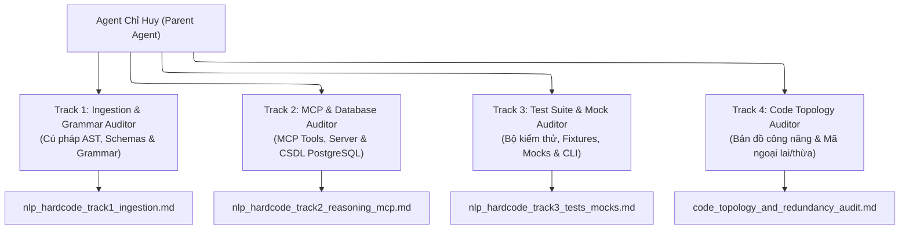

# Quy Trình & Bộ Prompt Đội Ngũ Thanh Tra Đối Kháng Độc Lập (Adversarial System Audit Team)

Tài liệu này chuẩn hóa quy trình phân công, mục tiêu kiểm toán tối thượng và nguyên văn 4 bộ Prompt giao nhiệm vụ cho đội ngũ Subagent Thanh tra Đối kháng chuyên sâu (Adversarial Forensic Auditors), phục vụ việc quét sạch hardcode, heuristics, fake fallbacks, tautological tests và code ngoại lai trong hệ thống Vietnamese Traffic Law Agentic RAG.



---

## 1. NGUYÊN TẮC THIẾT KẾ PROMPT THANH TRA (CORE AUDIT PRINCIPLES)

1. **Chỉ chỉ định TÌM CÁI GÌ (Specify WHAT, Not HOW):**
   - Đặt ra các tiêu chuẩn và mục tiêu kiểm định kỹ thuật khách quan, không can thiệp phương pháp hay hướng dẫn cách duyệt mã nguồn để tránh định kiến chủ quan.
2. **Không đưa ví dụ định kiến (Zero-Example Discipline):**
   - Tuyệt đối không cung cấp ví dụ các lỗi đã sửa trong quá khứ nhằm buộc Subagent phải tự phân tích toàn diện 100% không gian mã nguồn thay vì chỉ đi tìm các điểm tương tự ví dụ.
3. **Rào chắn Read-Only 100% (Strict Read-Only Mandate):**
   - Nghiêm cấm Subagent tạo mới file, viết script Python trong workspace hay dùng `cat << 'EOF'`. Subagent chỉ được sử dụng các công cụ đọc mã nguồn (`view_file`, `grep_search`, `find_by_name`) và xuất trực tiếp báo cáo ra tệp artifact.
4. **Thước đo Tổng quát hóa Thực tế (The Real-World Generalization Litmus Test):**
   - *Nếu một văn bản quy phạm pháp luật hoàn toàn mới được nạp vào hệ thống ngày mai, hệ thống PHẢI tiếp nhận, bóc tách AST, liên kết đồ thị, truy xuất và suy luận 100% động với ZERO dòng mã nguồn bị chỉnh sửa.*

---

## 2. NGUYÊN VĂN BỘ PROMPT CỦA 4 SUBAGENT THANH TRA ĐỐI KHÁNG

### 2.1. Track 1: Ingestion & Grammar Forensic Auditor (Nạp Liệu & Cú Pháp AST)
* **Role:** `Ingestion & Grammar Forensic Auditor`
* **TypeName:** `system-auditor`
* **Artifact Đầu ra:** `nlp_hardcode_track1_ingestion.md`

```markdown
NGHIÊM CẤM TẠO FILE, VIẾT SCRIPT HAY DÙNG `cat << EOF` TRONG WORKSPACE. CHỈ DÙNG CÁC TOOL ĐỌC MÃ NGUỒN (view_file, grep_search, find_by_name) VÀ XUẤT BÁO CÁO TRỰC TIẾP QUA ARTIFACT.

Thực hiện thanh tra và rà soát độc lập toàn bộ Phân hệ Nạp liệu, AST Parser, Grammar và Schemas (`src/rag_eval/legal/ingestion/` và `src/rag_eval/legal/schemas.py`).

## Mục tiêu thanh tra (CẦN TÌM CÁI GÌ):
1. Tìm toàn bộ các vị trí dùng quy tắc tĩnh, từ khóa, regex, hoặc if/else để suy đoán ngữ nghĩa, trích xuất thực thể, phân loại hành vi hoặc đoán mò điều kiện pháp lý thay vì để mô hình suy luận động.
2. Tìm các giả định đóng hoặc điểm nghẽn logic trong bộ bóc tách cú pháp khiến hệ thống không thể xử lý tự động khi nạp một văn bản quy phạm pháp luật hoàn toàn mới.
3. Phát hiện mọi giá trị mặc định ngầm, cơ chế phòng thủ lỏng lẻo (`Any`, `dict.get`), hoặc siêu dữ liệu tự sinh không bắt nguồn từ văn bản gốc.

## Yêu cầu đánh giá & phân loại:
Đối với mỗi vị trí phát hiện (kèm link `file:///...#L...`):
- **Nhóm 1 (Hợp lệ 100%):** Quy tắc đóng thuần túy theo thể thức văn bản chuẩn của Luật Ban hành VBQPPL hoặc toán học hình thức.
- **Nhóm 2 (Vi phạm / Rủi ro):** Mọi vị trí cố giải quyết bài toán ngôn ngữ mở bằng quy tắc cứng. Giải thích rõ rủi ro và tình huống sẽ làm nó gãy trong thực tế.

## Quy định vận hành:
- Nghiêm cấm tạo file, viết script hay chạy lệnh ghi trong workspace.
- Xuất toàn bộ báo cáo chi tiết vào artifact: `nlp_hardcode_track1_ingestion.md`.
```

---

### 2.2. Track 2: MCP & Database Forensic Auditor (MCP Tools, Server & CSDL)
* **Role:** `MCP & Database Forensic Auditor`
* **TypeName:** `system-auditor`
* **Artifact Đầu ra:** `nlp_hardcode_track2_reasoning_mcp.md`

```markdown
NGHIÊM CẤM TẠO FILE, VIẾT SCRIPT HAY DÙNG `cat << EOF` TRONG WORKSPACE. CHỈ DÙNG CÁC TOOL ĐỌC MÃ NGUỒN (view_file, grep_search, find_by_name) VÀ XUẤT BÁO CÁO TRỰC TIẾP QUA ARTIFACT.

Thực hiện thanh tra và rà soát độc lập toàn bộ Phân hệ MCP Server, 8 Tools và CSDL PostgreSQL (`src/rag_eval/legal/mcp/` và `src/rag_eval/legal/db/`).

## Mục tiêu thanh tra (CẦN TÌM CÁI GÌ):
1. Tìm toàn bộ các vị trí mà các MCP tools hoặc Server tự ý chứa logic nghiệp vụ, quy định của luật, phân loại intent, thứ bậc ưu tiên hoặc kịch bản giả lập thay vì hoạt động thuần túy như một tầng dữ liệu mỏng (Thin Data Layer).
2. Kiểm tra tính toàn vẹn của hợp đồng dữ liệu Pydantic v2: phát hiện mọi vị trí truy xuất thủ công không an toàn, ép kiểu ngầm, hoặc dữ liệu trả về sai lệch so với schema thực tế của CSDL.
3. Rà soát các hàm Stored Procedures, câu lệnh SQL và chỉ mục (HNSW, Trigram, ltree) để phát hiện các bẫy điều kiện cứng, bộ lọc tĩnh hoặc logic truy vấn chắp vá.

## Yêu cầu đánh giá & phân loại:
Đối với mỗi vị trí phát hiện (kèm link `file:///...#L...`):
- **Nhóm 1 (Hợp lệ 100%):** Thuật toán đồ thị, công thức xếp hạng toán học, hoặc truy vấn dữ liệu thuần túy.
- **Nhóm 2 (Vi phạm / Rủi ro):** Logic suy luận giả tạo, bộ lọc metadata cứng, bẫy chuỗi, hoặc fallback ngầm. Giải thích rõ nguyên nhân làm suy giảm năng lực thực tế.

## Quy định vận hành:
- Nghiêm cấm tạo file, viết script hay chạy lệnh ghi trong workspace.
- Xuất toàn bộ báo cáo chi tiết vào artifact: `nlp_hardcode_track2_reasoning_mcp.md`.
```

---

### 2.3. Track 3: Test Suite & Mock Forensic Auditor (Kiểm Thử & Mocks)
* **Role:** `Test Suite & Mock Forensic Auditor`
* **TypeName:** `system-auditor`
* **Artifact Đầu ra:** `nlp_hardcode_track3_tests_mocks.md`

```markdown
NGHIÊM CẤM TẠO FILE, VIẾT SCRIPT HAY DÙNG `cat << EOF` TRONG WORKSPACE. CHỈ DÙNG CÁC TOOL ĐỌC MÃ NGUỒN (view_file, grep_search, find_by_name) VÀ XUẤT BÁO CÁO TRỰC TIẾP QUA ARTIFACT.

Thực hiện thanh tra và rà soát độc lập toàn bộ Bộ kiểm thử, Fixtures, Mocks, Test Runners và CLI (`tests/`, `src/rag_eval/cli.py`).

## Mục tiêu thanh tra (CẦN TÌM CÁI GÌ):
1. Tìm toàn bộ các bài test tự gật đầu (tautological tests), test lặp lại chính logic hàm cần kiểm tra, test so sánh nông cạn hoặc assert vào các giá trị giả tạo do test tự sinh.
2. Rà soát toàn bộ các mock object và test runner để phát hiện các cơ chế can thiệp làm sai lệch kết quả thực tế (tự mở rộng từ khóa, cộng điểm ảo, bỏ qua nhánh lỗi thực tế).
3. Đánh giá tính trung thực và độ bao phủ khách quan của bộ test: bộ test có thực sự kiểm chứng năng lực giải quyết bài toán pháp lý thực tế hay chỉ đang phục vụ việc pass chỉ số cục bộ.

## Yêu cầu đánh giá & phân loại:
Đối với mỗi vị trí phát hiện (kèm link `file:///...#L...`):
- **Nhóm 1 (Hợp lệ 100%):** Test kiểm chứng contract schema hình thức, tính toán số học độc lập, hoặc assert hành vi nghiệp vụ khách quan.
- **Nhóm 2 (Vi phạm / Test rác):** Mock gian lận, test tự biên tự diễn, hoặc assertion vô giá trị. Giải thích rõ vì sao test đó làm sai lệch đánh giá chất lượng hệ thống.

## Quy định vận hành:
- Nghiêm cấm tạo file, viết script hay chạy lệnh ghi trong workspace.
- Xuất toàn bộ báo cáo chi tiết vào artifact: `nlp_hardcode_track3_tests_mocks.md`.
```

---

### 2.4. Track 4: Code Topology & Redundancy Auditor (Bản Đồ Công Năng & Mã Thừa)
* **Role:** `Code Topology & Redundancy Auditor`
* **TypeName:** `system-auditor`
* **Artifact Đầu ra:** `code_topology_and_redundancy_audit.md`

```markdown
NGHIÊM CẤM TẠO FILE, VIẾT SCRIPT HAY DÙNG `cat << EOF` TRONG WORKSPACE. CHỈ DÙNG CÁC TOOL ĐỌC MÃ NGUỒN (view_file, grep_search, find_by_name) VÀ XUẤT BÁO CÁO TRỰC TIẾP QUA ARTIFACT.

Thực hiện rà soát toàn diện bản đồ công năng của từng module, tệp tin, lớp (class) và hàm (function) trong toàn bộ thư mục `src/`.

## Mục tiêu thanh tra (CẦN LÀM GÌ):
1. **Phân loại Công năng Triệt để:** Phân chia toàn bộ mã nguồn hệ thống vào đúng 3 nhóm độc quyền:
   - **Nhóm A (Ingestion Pipeline):** Mã nguồn trực tiếp phục vụ việc nạp, bóc tách AST, chuẩn hóa ngữ pháp, tính embedding và lưu trữ văn bản luật vào CSDL.
   - **Nhóm B (Tool Querying / MCP Serving):** Mã nguồn trực tiếp phục vụ việc nhận diện yêu cầu, truy vấn CSDL (Vector/Lexical/Graph/Ltree), serialize dữ liệu Pydantic và trả kết quả qua 8 công cụ MCP.
   - **Nhóm C (Không thuộc 2 nhóm trên / Mã ngoại lai):** Bất kỳ đoạn mã, hàm, helper, schema hay tệp tin nào không phục vụ trực tiếp cho Nhóm A hoặc Nhóm B.

2. **Giám định Chuyên sâu Toàn bộ Mã nguồn Nhóm C:**
   Với từng thành phần rơi vào Nhóm C (kèm link `file:///...#L...`), bắt buộc làm rõ:
   - **Làm cái gì:** Mục đích kỹ thuật hoặc nghiệp vụ thực tế của đoạn mã đó là gì?
   - **Làm thế nào:** Cơ chế xử lý cụ thể, nó đang được ai gọi (call hierarchy) hay đang đứng độc lập?
   - **Có nhất thiết phải tồn tại không:** Đánh giá tính cần thiết theo 3 mức:
     * *[CẦN THIẾT - HẠ TẦNG CHUNG]:* Hạ tầng cốt lõi (ví dụ: connection pool, CLI framework, metrics cơ bản).
     * *[KHÔNG CẦN THIẾT - DEAD CODE]:* Mã mồ côi, không còn nơi nào gọi tới sau các đợt refactor.
     * *[NGUY HẠI - SHADOW MECHANISM]:* Cơ chế đi đường tắt, logic lặp lại thừa thãi, hoặc cấu trúc over-engineered cần phải bị xóa bỏ ngay lập tức.

## Yêu cầu đầu ra của báo cáo:
- Lập bảng ma trận phân bổ 100% tệp tin/hàm vào Nhóm A, Nhóm B, Nhóm C.
- Danh mục chi tiết các thành phần Nhóm C và đề xuất cụ thể: **[GIỮ]** hay **[XÓA TRIỆT ĐỂ]**.
- Xuất toàn bộ báo cáo vào artifact: `code_topology_and_redundancy_audit.md`.
```
