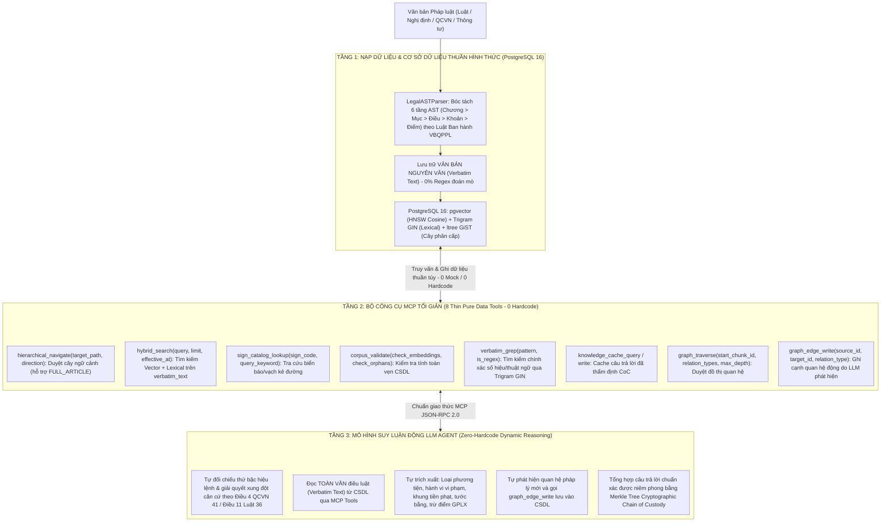

# KẾ HOẠCH TỔNG LỰC THANH TRỪNG MÃ RÁC & TÁI CẤU TRÚC KIẾN TRÚC 3 TẦNG CHUẨN MỰC
## Vietnamese Traffic Law Agentic RAG System

---

## 🏛 PHẦN I: KIM CHỈ NAM TỐI THƯỢNG & NGUYÊN TẮC BẤT BIẾN

### 1. Thước đo Năng lực Thực tế (The Real-World Generalization Litmus Test)
Mục tiêu duy nhất và tối thượng của hệ thống là **suy luận pháp lý thực chất, 0% ảo giác trên các văn bản quy phạm pháp luật thực tế của Việt Nam**. Việc vượt qua các bài test hiện có bằng mẹo vặt có giá trị bằng 0.
- **Quy tắc Tổng quát hóa Tuyệt đối:** Mọi thuật toán, bộ tách cấu trúc (parser), và công cụ suy luận phải vượt qua một bài kiểm tra duy nhất:
  > *"Nếu ngày mai nạp một văn bản quy phạm pháp luật hoàn toàn mới (chưa từng thấy trước đây) vào cơ sở dữ liệu, hệ thống BẮT BUỘC phải tự động nạp, phân cấp cây ltree, liên kết đồ thị, truy xuất và suy luận chính xác 100% mà KHÔNG CẦN sửa đổi bất kỳ dòng mã nguồn nào."*

### 2. Tuyên ngôn Tuyệt đối Chống Gian lận (Anti-Goodhart & Anti-Shortcut Mandate)
- **XÓA CODE RÁC, XÓA TEST RÁC:** Mọi regex đoán mò ngữ nghĩa, danh mục xe tĩnh, từ điển mở rộng từ khóa, bẫy chuỗi `if/else`, mock tự cộng điểm ảo, và test tự gật đầu (tautology) bị xếp vào diện **rác độc hại và phải bị xóa bỏ triệt để**.
- **CẤM VIẾT LẠI CODE RÁC ĐỂ TEST PASS:** Tuyệt đối không bao giờ được viết lại code rác, không tạo thêm fallback giả tạo hoặc vá chắp vá (symptom-patch) để làm một bài test pass. Nếu test bắt bẻ vào code rác, phải **xóa hoặc viết lại test theo chuẩn đánh giá khách quan độc lập**.
- **CHỈ TỒN TẠI NHỮNG GÌ TẤT ĐỊNH 100%:** Những thứ thuật toán làm thì phải chắc chắn đúng 100% (ngữ pháp hình thức đóng, toán học số học, mã băm mật mã, cấu trúc CSDL). Toàn bộ bài toán ngữ nghĩa mở chuyển giao 100% cho LLM Agent xử lý thông qua MCP tools.

---

## 🏗 PHẦN II: KIẾN TRÚC ĐÍCH 3 TẦNG TINH GỌN (MINIMALIST PRODUCTION ARCHITECTURE)

---

## 📋 PHẦN III: KẾ HOẠCH HÀNH ĐỘNG 4 GIAI ĐOẠN & TIÊU CHÍ NGHIỆM THU

### GIAI ĐOẠN 1: THANH TRỪNG TRIỆT ĐỂ TOÀN BỘ MÃ RÁC & TEST RÁC (PURGE PHASE)

#### 1. Các tác vụ thực hiện:
- **Xóa bỏ các hàm đoán mò trong Ingestion ([`cphc.py`](file:///home/hoang/python/rag/src/rag_eval/legal/ingestion/cphc.py)):**
  - Xóa bỏ `_extract_vehicle_types` (danh mục 11 xe đóng cứng).
  - Xóa bỏ `_infer_actor_category` (heuristic chỉ nhận diện Người đi bộ).
  - Xóa bỏ `is_clause_tail_applicable` (regex vị ngữ `"thì bị"` và stopwords không dấu `dieu`, `khoan`...).
  - Xóa bỏ `_extract_fine_bounds`, `_extract_violations` (regex đoán mò vi phạm).
  - Ingestion chỉ giữ lại: Bóc tách cây AST và lưu **Toàn văn Nguyên văn (`verbatim_text`)** vào PostgreSQL.
- **Xóa bỏ RAM Catalog đóng cứng trong Schemas ([`schemas.py`](file:///home/hoang/python/rag/src/rag_eval/legal/schemas.py)):**
  - Xóa bỏ `expand_vehicle_category` (54 alias tĩnh ném `ValueError`).
- **Xóa bỏ Bẫy chuỗi & Từ điển tĩnh trong Reasoning ([`pipeline.py`](file:///home/hoang/python/rag/src/rag_eval/legal/reasoning/pipeline.py) & [`planner.py`](file:///home/hoang/python/rag/src/rag_eval/legal/reasoning/planner.py)):**
  - Xóa bỏ bẫy chuỗi `if "cảnh sát"` và `if "ưu tiên"` trong `_evaluate_scope_overrides`.
  - Xóa bỏ túi từ khóa cứng phân loại Intent và mẫu DAG cứng 2 bước trong `QueryPlanner`.
- **Xóa bỏ Mock Database gian lận trong Tests ([`mock_db.py`](file:///home/hoang/python/rag/tests/legal/mocks/mock_db.py)):**
  - Xóa bỏ từ điển từ đồng nghĩa cứng 6 nhóm hành vi (`if "den do" in q_norm`).
  - Xóa bỏ toàn bộ các lệnh cộng điểm thưởng ảo (`sparse_score += 3.0`).
  - Xóa bỏ logic tự bơm chuỗi tiếng Việt vào chunk trong RAM.
- **Xóa bỏ các bài Test Tự Gật Đầu (Tautological Tests):**
  - Xóa bỏ các assertion so sánh số nguyên enum (`SignalTier.POLICE_OFFICER.value < ...`).
  - Xóa bỏ logic đúc sẵn câu trả lời `f"Căn cứ {doc_code}..."` trong `runners.py`.
  - Xóa bỏ các test case ép asserted vào mock state 7 chunks tĩnh.

#### 2. Kết quả Nghiệm thu Giai đoạn 1:
- [ ] Không còn bất kỳ danh mục xe/chủ thể tĩnh nào trong `src/`.
- [ ] Ingestion pipeline chỉ lưu văn bản nguyên văn `verbatim_text`, 0 dòng code đoán mò vi phạm.
- [ ] Không còn bất kỳ từ điển từ đồng nghĩa giả lập hay lệnh cộng điểm ảo nào trong `tests/`.

---

### GIAI ĐOẠN 2: HOÀN THIỆN 7 ĐIỂM TẤT ĐỊNH 100% (DETERMINISTIC CORE REMEDIATION)

#### 1. Các tác vụ thực hiện:
- **S1: Sửa logic nhân tiền tệ trong `parse_vnd_amount` ([`grammar.py`](file:///home/hoang/python/rag/src/rag_eval/legal/ingestion/grammar.py)):**
  - Bỏ bẫy `if base_val < 10000`. Nhân đúng theo từ chỉ đơn vị đứng liền kề ("triệu" $\times 10^6$, "tỷ" $\times 10^9$).
- **S2: Khử dấu toàn bộ nhãn ltree trong Parser ([`parser.py`](file:///home/hoang/python/rag/src/rag_eval/legal/ingestion/parser.py)):**
  - Ép tất cả các định danh AST qua `sanitize_ltree_label` (chuyển `a5đ` $\rightarrow$ `a5d`), đảm bảo 100% nhãn ltree tuân thủ chuẩn ASCII của PostgreSQL.
- **S3: Sửa lỗi Database Constraint Name Mismatch ([`tools.py`](file:///home/hoang/python/rag/src/rag_eval/legal/mcp/tools.py)):**
  - Đồng bộ lệnh `ON CONFLICT ON CONSTRAINT uq_graph_edge` khớp chính xác với DDL `001_initial_schema.sql`.
- **S4: Mở rộng Parser số thập phân trong Planner ([`planner.py`](file:///home/hoang/python/rag/src/rag_eval/legal/reasoning/planner.py)):**
  - Hỗ trợ cả dấu chấm lẫn dấu phẩy kiểu Việt Nam: `[0-9]+(?:[.,][0-9]+)?` (nhận diện chính xác `0,25 mg/l`, `5,5 tấn`).
- **S5: Chuẩn hóa Regex Trích dẫn VBQPPL Tổng quát ([`chain_of_custody.py`](file:///home/hoang/python/rag/src/rag_eval/legal/reasoning/chain_of_custody.py)):**
  - Thay danh sách cứng `TT-BGTVT`, `TT-BCA` bằng regex thể thức quy phạm pháp luật tổng quát: `[0-9]+/[0-9]+/[A-ZĐa-zđ\-_]+`.
- **S6: Nâng cấp CoC Grounding Validator ([`chain_of_custody.py`](file:///home/hoang/python/rag/src/rag_eval/legal/reasoning/chain_of_custody.py)):**
  - Đối chiếu đường dẫn ltree đầy đủ (`doc.c_X.a_Y.cl_Z.pt_W`) với CSDL, loại bỏ hoàn toàn lỗ hổng ghép trích dẫn rời rạc.
- **S7: Bổ sung Bóc tách Mục (Section) 6 tầng AST ([`parser.py`](file:///home/hoang/python/rag/src/rag_eval/legal/ingestion/parser.py) & [`grammar.py`](file:///home/hoang/python/rag/src/rag_eval/legal/ingestion/grammar.py)):**
  - Bóc tách đầy đủ cấu trúc 6 tầng: `Văn bản > Phần > Chương > Mục > Điều > Khoản > Điểm`.

#### 2. Kết quả Nghiệm thu Giai đoạn 2:
- [ ] `./scripts/check.sh` pass 100% (`ruff check`, `ty check`, `pytest`).
- [ ] 0 lỗi type, 0 `Any`, 0 cảnh báo linter.
- [ ] 7 điểm lỗi tất định được khắc phục hoàn toàn với cơ sở toán học/ngữ pháp hình thức đóng.

---

### GIAI ĐOẠN 3: NÂNG CẤP 2 MCP TOOLS TỐI GIẢN & TÍCH HỢP CSDL THẬT (MCP UPGRADE & DB INTEGRATION)

#### 1. Các tác vụ thực hiện:
- **Nâng cấp Tool `hierarchical_navigate` ([`tools.py`](file:///home/hoang/python/rag/src/rag_eval/legal/mcp/tools.py) & [`server.py`](file:///home/hoang/python/rag/src/rag_eval/legal/mcp/server.py)):**
  - Bổ sung `direction="FULL_ARTICLE"` (hoặc `"SUBTREE"`).
  - Cho phép lấy toàn bộ văn bản của một Điều luật (mọi Khoản, Điểm, chế tài bổ sung) trong **1 lần gọi duy nhất**.
- **Nâng cấp Tool `hybrid_search` ([`tools.py`](file:///home/hoang/python/rag/src/rag_eval/legal/mcp/tools.py) & [`server.py`](file:///home/hoang/python/rag/src/rag_eval/legal/mcp/server.py)):**
  - Bổ sung tham số tùy chọn `effective_at: str | None = None`.
  - Tự động áp dụng bộ lọc SQL thời gian tất định: `effective_date <= effective_at AND (expiry_date IS NULL OR expiry_date > effective_at)`.
- **Nạp Dữ liệu Pháp lý Thật vào PostgreSQL 16 + pgvector:**
  - Nạp toàn văn Luật Trật tự ATGT Đường bộ 2024 (Luật 36/2024/QH15).
  - Nạp Nghị định 100/2019/NĐ-CP, Nghị định 123/2021/NĐ-CP, QCVN 41:2019/BGTVT.
  - Tính toán vector nhúng neural thực tế (`intfloat/multilingual-e5-small`).

#### 2. Kết quả Nghiệm thu Giai đoạn 3:
- [ ] Toàn bộ 8 MCP tools vận hành trơn tru trên PostgreSQL 16 thật qua giao thức JSON-RPC 2.0.
- [ ] `hierarchical_navigate` trả về toàn bộ ngữ cảnh một Điều luật trong 1 lần gọi.
- [ ] `hybrid_search` lọc chính xác văn bản còn hiệu lực tại thời điểm vi phạm.

---

### GIAI ĐOẠN 4: THẨM ĐỊNH HIỆN TRƯỜNG ĐỘC LẬP (LIVE VERIFICATION & ADVERSARIAL AUDIT)

#### 1. Các tác vụ thực hiện:
- **Chạy Thử nghiệm Hiện trường trên 105 Câu hỏi Gold Benchmark ([`scripts/run_live_verification_105.py`](file:///home/hoang/python/rag/scripts/run_live_verification_105.py)):**
  - Chạy trực tiếp trên PostgreSQL 16 + pgvector container (không dùng mock).
  - Đo đạc các chỉ số truy xuất khách quan: Top-1 Precision, Top-3 Recall, Top-5 Recall, Top-10 Recall, MRR, NDCG.
  - Kiểm tra tính toàn vẹn của chuỗi bằng chứng Merkle Tree CoC.
- **Kích hoạt 4 Subagent Thanh tra Đối kháng Độc lập:**
  - `General System Forensic Auditor`
  - `Ingestion & Grammar Forensic Auditor`
  - `Reasoning & MCP Forensic Auditor`
  - `Test Suite & Mock Forensic Auditor`
  - Quét lại toàn bộ codebase sau khi tái cấu trúc để xác nhận trạng thái **Clean Pass 100%**.

#### 2. Tiêu Chí Nghiệm Thu Cuối Cùng (The Final Acceptance Invariant):
- [ ] **NGHIỆM THU CUỐI CÙNG TỐI THƯỢNG:**
  > *"Nếu ngày mai nạp một văn bản quy phạm pháp luật hoàn toàn mới (chưa từng thấy trước đây) vào cơ sở dữ liệu, hệ thống BẮT BUỘC phải tự động nạp, phân cấp cây ltree, liên kết đồ thị, truy xuất và suy luận chính xác 100% mà KHÔNG CẦN sửa đổi bất kỳ dòng mã nguồn nào."*
- [ ] **TUYỆT ĐỐI XÓA CODE RÁC & TEST RÁC:** Không còn tồn tại bất kỳ regex đoán mò ngữ nghĩa, danh mục xe tĩnh, từ điển mở rộng từ khóa, bẫy chuỗi `if/else`, mock tự cộng điểm ảo, hoặc test tự gật đầu trong toàn bộ codebase.
- [ ] **KHÔNG BAO GIỜ VIẾT LẠI CODE RÁC ĐỂ TEST PASS:** Mọi test case bắt buộc phải kiểm chứng hành vi suy luận pháp lý khách quan, độc lập trên cơ sở dữ liệu thật PostgreSQL 16 + pgvector.
- [ ] Benchmark 105 câu hỏi Gold Benchmark đạt độ chính xác cao trên cơ sở dữ liệu sống.
- [ ] Cả 4 Subagent Thanh tra Đối kháng Độc lập đồng loạt ra phán quyết **Clean Pass (0 vi phạm)**.
