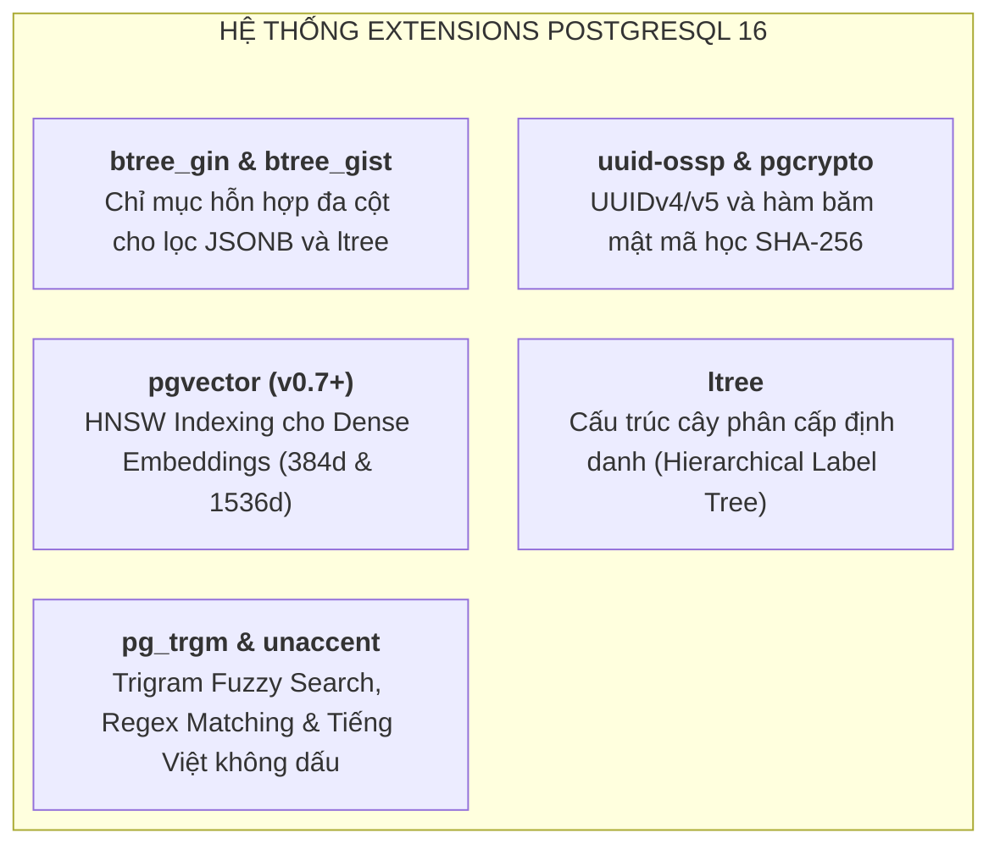
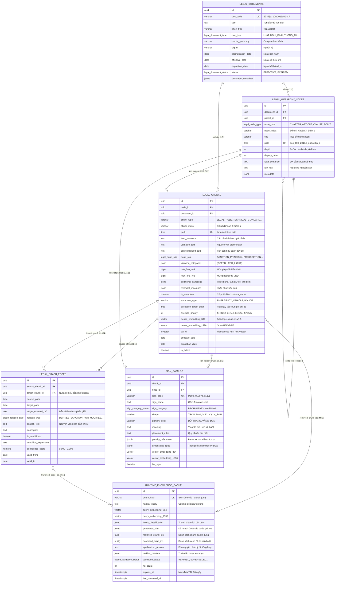
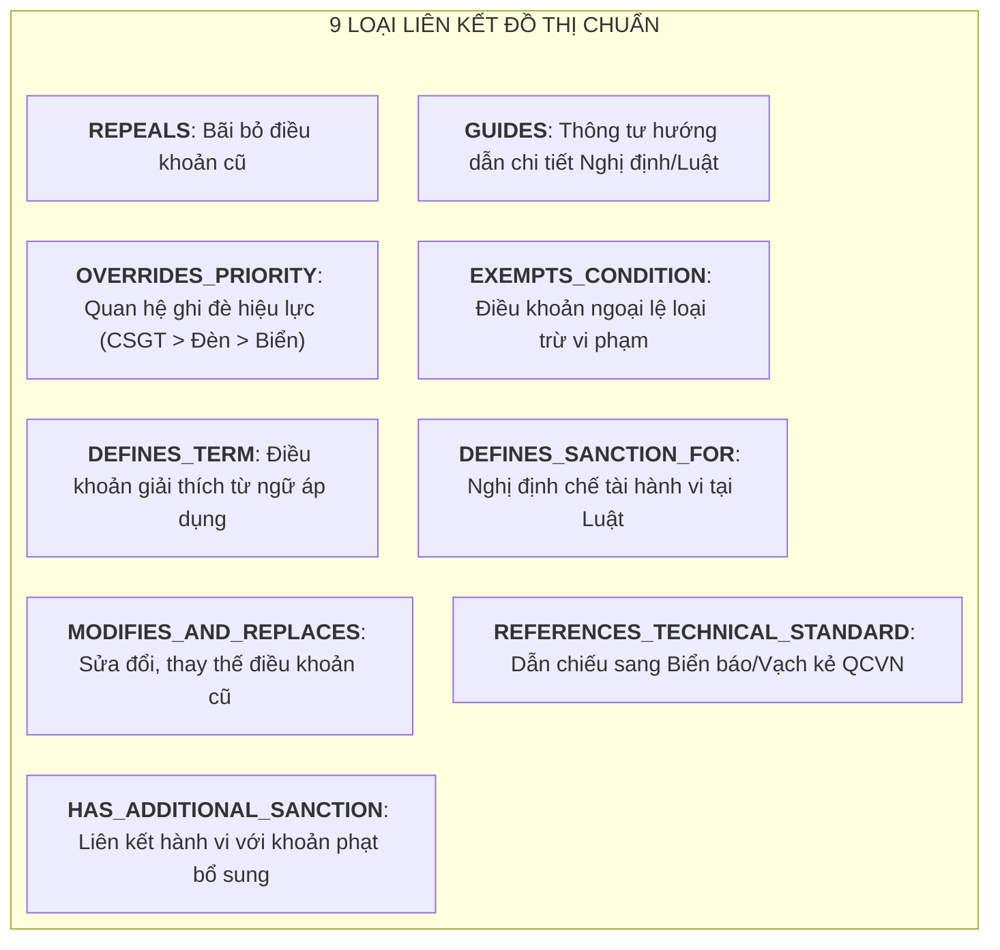

# Kiến trúc Cơ sở Dữ liệu Pháp luật Giao thông (Database Architecture Specification)

Tài liệu này mô tả chi tiết toàn bộ cấu trúc, lược đồ dữ liệu (schema), hệ thống chỉ mục đa phương thức (multi-modal indexing), thủ tục lưu trữ (stored procedures) và các trigger tự động trong cơ sở dữ liệu PostgreSQL của hệ thống RAG Pháp luật Giao thông.

---

## 1. Tổng quan Kiến trúc & Các Extension Cốt lõi

Cơ sở dữ liệu được xây dựng trên nền tảng **PostgreSQL 16** kết hợp các extension chuyên biệt để phục vụ mô hình tìm kiếm lai (Hybrid Search), đồ thị tri thức (Knowledge Graph) và cây phân cấp cú pháp (AST Hierarchy):

---

## 2. Sơ đồ Thực thể - Quan hệ (Entity-Relationship Diagram)

---

## 3. Chi tiết Cấu trúc Từng Bảng Dữ liệu

### 3.1. Bảng `legal_documents` (Văn bản Quy phạm Pháp luật)
Lưu trữ thông tin định danh cấp cao nhất của các văn bản pháp luật (Luật, Nghị định, Thông tư, Quy chuẩn).

- **Khóa chính**: `id (UUID)`
- **Ràng buộc duy nhất**: `doc_code (VARCHAR 128)` — Ví dụ: `"100/2019/NĐ-CP"`, `"QCVN 41:2019/BGTVT"`.
- **Phân loại**:
  - `doc_type`: Enum `legal_document_type` (`'LUAT'`, `'NGHI_DINH'`, `'THONG_TU'`, `'QUY_CHUAN_KY_THUAT'`, `'QUYET_DINH'`).
  - `status`: Enum `legal_document_status` (`'EFFECTIVE'`, `'PARTIALLY_EXPIRED'`, `'EXPIRED'`, `'NOT_YET_EFFECTIVE'`).
- **Thời gian hiệu lực**: `promulgation_date` (Ngày ban hành), `effective_date` (Ngày có hiệu lực), `expiration_date` (Ngày hết hiệu lực). Ràng buộc `chk_doc_dates CHECK (expiration_date IS NULL OR expiration_date >= effective_date)`.

---

### 3.2. Bảng `legal_hierarchy_nodes` (Cây Cú pháp Phân cấp AST)
Hiện thực hóa cây cú pháp trừu tượng (Abstract Syntax Tree) của văn bản thông qua extension `ltree`.

- **Cấu trúc phân cấp**:
  - `node_type`: `'DOCUMENT'`, `'PART'`, `'CHAPTER'`, `'SECTION'`, `'SUB_SECTION'`, `'ARTICLE'`, `'CLAUSE'`, `'POINT'`, `'APPENDIX'`, `'SIGN_SPEC'`, `'MARKING_SPEC'`, `'TABLE'`.
  - `depth`: Cấp bậc phân cấp (1 = Document, 2 = Chapter/Appendix, 4 = Article, 5 = Clause, 6 = Point).
  - `path (LTREE)`: Chuỗi nhãn phân cấp phân tách bằng dấu chấm. Ví dụ: `doc_100_2019_nd_cp.c_ii.a5.c3.p_a`.
- **Ngữ cảnh kế thừa**:
  - `lead_sentence`: Lưu trữ câu dẫn đầu của Khoản/Điều trực tiếp để truyền xuống các Điểm con.
  - `raw_text`: Văn bản nguyên văn của nút.
- **Chỉ mục**:
  - `idx_legal_nodes_path_gist ON legal_hierarchy_nodes USING gist (path)`: Tối ưu cho toán tử con cháu (`<@`), tổ tiên (`@>`).
  - `idx_legal_nodes_index_trgm USING gin (node_index gin_trgm_ops)`: Tìm kiếm nhanh chỉ số điều/khoản.

---

### 3.3. Bảng `legal_chunks` (Canonical Fully Qualified Chunks - CFQC)
Đây là **bảng trung tâm của toàn bộ hệ thống RAG**, nơi lưu trữ các đơn vị pháp lý nguyên tử có thể truy vấn độc lập mà vẫn bảo toàn 100% ngữ cảnh phân cấp.

- **Định danh & Phân cấp**:
  - `node_id (UUID)` tham chiếu trực tiếp đến `legal_hierarchy_nodes(id)`.
  - `path (LTREE)` kế thừa trực tiếp từ node, bảo đảm tính duy nhất (`UNIQUE`).
- **Biểu diễn Nội dung Đa tầng**:
  - `verbatim_text`: Văn bản gốc nguyên bản của Điểm/Khoản.
  - `contextualized_text`: Chuỗi văn bản tổng hợp đầy đủ ngữ cảnh CPHC theo định dạng:
    `[VĂN BẢN] > [CHƯƠNG] > [ĐIỀU] > [KHOẢN - LỜI DẪN] > [ĐIỂM - NỘI DUNG] > [CHẾ TÀI BỔ SUNG]`.
- **Mô hình Chế tài & Nghĩa vụ (Legal Norms)**:
  - `norm_role`: Enum `legal_norm_role` (`SANCTION_PRINCIPAL`, `SANCTION_SUPPLEMENTARY`, `SANCTION_POINT_DEDUCTION`, `HYPOTHESIS_CONDITION`, `PRESCRIPTION_DUTY`, v.v.).
  - `min_fine_vnd`, `max_fine_vnd`: Khung tiền phạt tính theo VNĐ. Ràng buộc `min_fine_vnd <= max_fine_vnd`.
  - `additional_sanctions (JSONB)`: Chế tài bổ sung (thời hạn tước GPLX, số ngày tạm giữ phương tiện, số điểm trừ GPLX).
  - `remedial_measures (JSONB)`: Biện pháp khắc phục hậu quả.
- **Quyền Ưu tiên & Điều khoản Ngoại lệ**:
  - `is_exception`: Đánh dấu điều khoản ngoại lệ loại trừ trách nhiệm (*"trừ trường hợp..."*).
  - `override_priority`: Thứ tự ưu tiên hiệu lực tín hiệu (1 = CSGT, 2 = Đèn tín hiệu, 3 = Biển báo, 4 = Vạch kẻ, 5 = Quy tắc chung).
- **Embeddings & Tìm kiếm Toàn văn**:
  - `dense_embedding_384 VECTOR(384)`: Index HNSW chuẩn BAAI/bge-small-en-v1.5.
  - `dense_embedding_1536 VECTOR(1536)`: Index HNSW chuẩn OpenAI/BGE-M3.
  - `tsv_vi TSVECTOR`: Vector tìm kiếm toàn văn tiếng Việt không dấu (sử dụng configuration `vietnamese_legal`).

---

### 3.4. Bảng `legal_graph_edges` (Đồ thị Quan hệ Tri thức Pháp lý)
Lưu trữ mạng lưới liên kết có hướng giữa các điều khoản pháp luật, hiện thực hóa **Bộ ba Quy phạm Decoupled (Decoupled Normative Triad)**.

- **Ràng buộc Idempotency**: `CONSTRAINT uq_graph_edge UNIQUE NULLS NOT DISTINCT (source_chunk_id, target_chunk_id, relation_type)`. Cho phép lưu trữ an toàn các liên kết dẫn chiếu ngoài chưa phân giải (`target_chunk_id IS NULL`).
- **Chỉ số Tin cậy**: `confidence_score NUMERIC(4, 3)` từ `0.000` đến `1.000`.

---

### 3.5. Bảng `sign_catalog` (Quy chuẩn Kỹ thuật Biển báo & Vạch kẻ đường)
Lưu trữ toàn bộ thông số kỹ thuật, hình dạng, màu sắc, ý nghĩa và vị trí hiệu lực của hệ thống báo hiệu đường bộ theo *QCVN 41:2019/BGTVT*.

- **Mã hiệu & Danh mục**:
  - `sign_code (VARCHAR 64 UNIQUE)`: `P.102`, `W.207a`, `R.301a`, `I.407a`, `S.501`, `M.1.1`.
  - `sign_category`: Enum `sign_category_enum` (`PROHIBITORY`, `WARNING`, `MANDATORY`, `GUIDE`, `AUXILIARY`, `ROAD_MARKING`, `TRAFFIC_LIGHT`, `POLICE_SIGNAL`).
- **Thông số Hình học**: `shape` (TRÒN, TAM_GIÁC, CHỮ_NHẬT), `primary_color` (ĐỎ_TRẮNG, VÀNG_ĐEN, XANH_TRẮNG), `dimensions_spec (JSONB)`.
- **Liên kết Phạt**: `penalty_references (JSONB)` chứa danh sách các ltree path trỏ đến các điều khoản xử phạt trong Nghị định 100/Nghị định 123.

---

### 3.6. Bảng `runtime_knowledge_cache` (Bộ nhớ Đệm & Vết Bằng chứng Suy luận)
Lưu trữ các câu trả lời pháp lý đã qua kiểm chứng (Verified Citations) kèm dấu vết chuỗi chứng cứ (Proof of Provenance) để tăng tốc độ phản hồi xuống **$< 0.5\text{ms}$** cho các câu hỏi trùng lặp hoặc tương đồng ngữ nghĩa cao.

- **Định danh duy nhất**: `query_hash (VARCHAR 64 UNIQUE)` = `SHA-256(trim(lower(natural_query)))`.
- **Vector truy vấn**: `query_embedding_384` & `query_embedding_1536` phục vụ Semantic Cache Matching.
- **Vết kiểm toán Agent**:
  - `retrieved_chunk_ids (UUID[])`: Mảng các chunk ID cấu thành câu trả lời.
  - `traversed_edge_ids (UUID[])`: Mảng các cạnh đồ thị đã duyệt qua.
  - `generated_plan (JSONB)`: DAG kế hoạch suy luận của LLM Agent.
- **Trạng thái Xác thực**: Enum `cache_validation_status` (`'CANDIDATE'`, `'VERIFIED'`, `'REJECTED'`, `'SUPERSEDED'`).

---

## 4. Hệ thống Chỉ mục Đa phương thức (Multi-Modal Indexes)

| Mục đích Tìm kiếm | Bảng Mục tiêu | Cột Chỉ mục | Loại Index | Tham số / Toán tử |
|---|---|---|---|---|
| **Dense Vector (HNSW)** | `legal_chunks` | `dense_embedding_384` | `HNSW` | `vector_cosine_ops` (`m=16, ef_construction=64`) |
| **Dense Vector (HNSW)** | `legal_chunks` | `dense_embedding_1536` | `HNSW` | `vector_cosine_ops` (`m=16, ef_construction=64`) |
| **Dense Vector (HNSW)** | `sign_catalog` | `vector_embedding_384` | `HNSW` | `vector_cosine_ops` (`m=16, ef_construction=64`) |
| **Dense Vector (HNSW)** | `runtime_knowledge_cache` | `query_embedding_384` | `HNSW` | `vector_cosine_ops` (`m=16, ef_construction=64`) |
| **Phân cấp Cây (`ltree`)** | `legal_hierarchy_nodes` | `path` | `GiST` | Hỗ trợ tìm kiếm con cháu `<@` và tổ tiên `@>` |
| **Phân cấp Cây (`ltree`)** | `legal_chunks` | `path` | `GiST` | Hỗ trợ lọc phạm vi điều/khoản nhanh |
| **Đồ thị Quan hệ** | `legal_graph_edges` | `source_path`, `target_path` | `GiST` | Tra cứu duyệt cạnh đồ thị phân cấp |
| **Trigram Regex/Fuzzy** | `legal_chunks` | `verbatim_text` | `GIN` | `gin_trgm_ops` (Tăng tốc verbatim grep & regex) |
| **Trigram Regex/Fuzzy** | `legal_chunks` | `contextualized_text` | `GIN` | `gin_trgm_ops` (Tăng tốc verbatim grep & regex) |
| **Trigram Mã hiệu** | `sign_catalog` | `sign_code`, `sign_name` | `GIN` | `gin_trgm_ops` (Tìm mã biển báo mờ) |
| **Full-Text Tiếng Việt** | `legal_chunks` | `tsv_vi` | `GIN` | `vietnamese_legal` configuration (unaccent) |
| **Full-Text Tiếng Việt** | `sign_catalog` | `tsv_sign` | `GIN` | `vietnamese_legal` configuration (unaccent) |
| **JSONB Cấu trúc** | `legal_chunks` | `additional_sanctions` | `GIN` | `jsonb_path_ops` (Lọc nhanh hình thức tước bằng/trừ điểm) |
| **Vô hiệu hóa Cache** | `runtime_knowledge_cache` | `retrieved_chunk_ids` | `GIN` | Mảng UUID (Tránh table scan khi trigger nổ) |

---

## 5. Thủ tục Lưu trữ (Stored Procedures) & Triggers

### 5.1. `hybrid_legal_search_384` & `hybrid_legal_search_1536`
Thực thi thuật toán tìm kiếm lai **Reciprocal Rank Fusion (RRF)** kết hợp giữa Dense Vector Search (pgvector HNSW) và Sparse Text Search (tsvector unaccented) trong một câu lệnh SQL duy nhất:

$$\text{RRF Score} = \frac{1}{k + \text{Rank}_{\text{dense}}} + \frac{1}{k + \text{Rank}_{\text{sparse}}} \quad (k = 60)$$

- Tự động áp dụng ràng buộc lát cắt thời gian hiệu lực:
  `effective_date <= t_violation AND (expiration_date IS NULL OR expiration_date > t_violation)`.

---

### 5.2. `verbatim_legal_grep`
Tìm kiếm chính xác từng ký tự hoặc Regular Expression có kiểm soát an toàn trên bảng `legal_chunks`:
- Hỗ trợ cả 2 nhánh:
  1. Nhánh Regex: Dùng toán tử `~` và `~*` được tăng tốc bởi GIN Trigram.
  2. Nhánh Phrase/Substring: Dùng toán tử `LIKE`, `ILIKE`, và `%` (Similarity).
- Tính toán điểm tương đồng `similarity_score` bằng hàm `similarity()`.

---

### 5.3. `resolve_scope_overrides`
Truy vấn các điều khoản ngoại lệ loại trừ trách nhiệm (`EXEMPTS_CONDITION`) và thứ bậc hiệu lực ghi đè (`OVERRIDES_PRIORITY`) trong cơ sở dữ liệu cho một nút mục tiêu:
- Tự động kiểm tra điều kiện xe ưu tiên (`is_emergency_vehicle = TRUE`).
- Trả về danh sách phán quyết sắp xếp theo thứ tự ưu tiên tăng dần (`override_priority ASC`).

---

### 5.4. Triggers Tự động Vô hiệu hóa Cache (Cache Invalidation Triggers)
Bảo đảm tính toàn vẹn tuyệt đối: Khi bất kỳ điều khoản luật nào bị sửa đổi hoặc bãi bỏ, toàn bộ câu trả lời trong Cache có sử dụng điều khoản đó sẽ bị hủy hiệu lực ngay lập tức:

1. **`trg_invalidate_cache_on_chunk_mutation`**:
   - Bắt sự kiện `UPDATE OF verbatim_text, min_fine_vnd, max_fine_vnd, is_active OR DELETE ON legal_chunks`.
   - Cập nhật `validation_status = 'SUPERSEDED'` cho các bản ghi cache có `target_id = ANY(retrieved_chunk_ids)`.
2. **`trg_invalidate_cache_on_edge_mutation`**:
   - Bắt sự kiện `INSERT OR UPDATE OR DELETE ON legal_graph_edges`.
   - Khi có quan hệ `MODIFIES_AND_REPLACES` hoặc `REPEALS`, lập tức chuyển trạng thái cache phụ thuộc sang `'SUPERSEDED'`.
